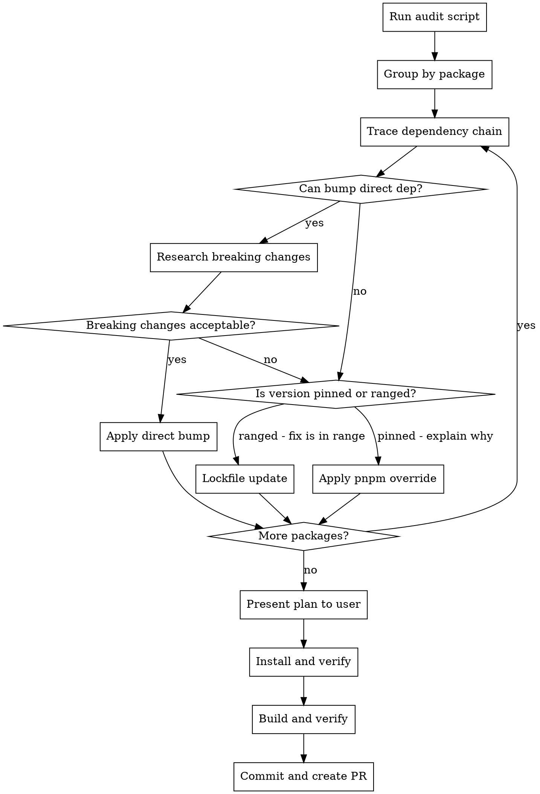

# Audit Dependencies

## Overview

Fix dependency vulnerabilities reported by `.github/workflows/audit-dependencies.sh`. Prefer fixes in this order: direct dependency bump > lockfile update > pnpm override. Every override requires justification for why simpler approaches aren't feasible.

## Core Workflow



## Step-by-Step

### 1. Run the Audit Script

```bash
./.github/workflows/audit-dependencies.sh $ARGUMENTS
```

`$ARGUMENTS` is the severity passed to the skill (defaults to `high` if omitted). The script runs `pnpm audit --prod --json` and filters for actionable vulnerabilities (those with a patched version available). `high` includes `critical`.

Parse the output to build a deduplicated list of vulnerable packages with:

- Package name and current version
- Fixed version requirement
- Full dependency chain (e.g., `packages/plugin-sentry > @sentry/nextjs > rollup`)

### 2. For Each Vulnerable Package

#### Trace the dependency chain

Identify whether the vulnerable package is:

- **Direct dependency**: Listed in a workspace package's `package.json`
- **Transitive dependency**: Pulled in by another package

#### Try direct bump first

For transitive deps, walk up the chain to find the nearest package you control:

1. Check if bumping the **parent package** resolves the vulnerability
   - `pnpm view <parent>@latest dependencies.<vulnerable-pkg>`
   - Check intermediate versions too (the fix may exist in a minor bump)
2. If the parent bump resolves it, research breaking changes:
   - Check changelogs/release notes
   - Search GitHub issues for compatibility problems
   - Review the API surface used in this repo (read the source files)
   - Check if the version range crosses a major version boundary
3. Present findings to user with risk assessment

**Parallelize research**: When multiple packages need breaking change analysis, dispatch parallel agents (one per package) to research simultaneously.

#### Check if a lockfile update is sufficient

Before reaching for an override, check whether the parent's version specifier is **pinned** (exact version like `3.10.3`) or **ranged** (like `^2.3.1`, `~4.0.3`):

```bash
pnpm view <parent> dependencies.<vulnerable-pkg>
```

If the range already includes the fixed version, a lockfile update is all that's needed:

```bash
pnpm update <vulnerable-pkg> --recursive
```

No `package.json` changes required — the lockfile was just stale.

#### Fall back to override only when justified

Add a pnpm override in root `package.json` only when:

- The parent pins an exact version that doesn't satisfy the fix
- No version of the parent package fixes the vulnerability
- The parent bump has high breaking change risk (major API changes, no test coverage, requires code changes across many files)
- The user explicitly decides to defer the parent bump to a separate PR

Override format: `"<parent>><vulnerable-pkg>": "^<fixed-version>"`

**Override syntax rules:**

- Use `^` ranges, not `>=`. `>=` can cross major versions and cause unexpected resolutions (e.g., `"picomatch": ">=2.3.2"` can resolve to 4.x).
- pnpm only supports single-level parent scoping: `"parent>pkg"` works, `"grandparent>parent>pkg"` does not.
- pnpm does not support version selectors in override keys: `"pkg@^2"` does not work.
- If the same vulnerable package appears through many transitive paths, a global override may be needed. Be careful that it doesn't affect unrelated consumers on a different major version — use parent-scoped overrides when the package spans multiple major versions across the tree.
- pnpm only honors `overrides` in the root workspace `package.json`. Overrides in workspace packages are ignored.

Before adding any override, verify the target version exists:

```bash
pnpm view <pkg>@<version> version
```

### 3. Present Plan to User

Before applying fixes, present a summary table to the user showing each vulnerability, the proposed fix strategy (direct bump / lockfile update / override), and justification. Get confirmation before proceeding.

### 4. Apply Fixes

- Edit `package.json` files for direct bumps
- Run `pnpm update <pkg> --recursive` for lockfile-only fixes
- Edit root `package.json` `pnpm.overrides` for overrides (keep alphabetical)
- If a direct bump changes behavior, update consuming code (e.g., adding `allowOverwrite: true` when an API default changes)

### 5. Install and Verify

```bash
pnpm install
```

If install fails due to native build errors (e.g., `better-sqlite3`), fall back to:

```bash
pnpm install --ignore-scripts
```

Then re-run the audit script with the same severity:

```bash
./.github/workflows/audit-dependencies.sh $ARGUMENTS
```

The audit script must exit 0. If vulnerabilities remain, check for additional instances of the same dependency in other workspace packages.

### 6. Build and Verify

```bash
pnpm run build:core
```

For packages with changed dependencies, also run their specific build:

```bash
pnpm run build:<package-name>
```

### 7. Look Up CVEs

For each fixed vulnerability, find the GitHub Security Advisory (GHSA):

- Check `https://github.com/<org>/<repo>/security/advisories` for each package
- Search the web for `<package-name> GHSA <fixed-version>`
- Record: GHSA ID, CVE ID, severity, one-line description
- Prefer GHSA links (`https://github.com/advisories/GHSA-xxxx-xxxx-xxxx`) over NVD links

**Parallelize CVE lookups**: Dispatch parallel agents to search for CVEs across all packages simultaneously.

### 8. Commit and Create PR

Commit with conventional commit format:

```
fix(deps): resolve $ARGUMENTS severity audit vulnerabilities
```

Create PR using `gh pr create` with this body structure:

```markdown
# Overview

[What the PR fixes, mention `pnpm audit --prod`]

## Key Changes

- **[Package name] in [workspace path]**
  - [old version] → [new version]. Fixes [GHSA-xxxx-xxxx-xxxx](https://github.com/advisories/GHSA-xxxx-xxxx-xxxx) ([description]).
  - [Why this approach: direct bump because X / lockfile update because Y / override because Z]
  - [Any code changes required by the bump]

## Design Decisions

[Why direct bumps were preferred, justification for any remaining overrides]
```

## Common Mistakes

| Mistake                                           | Fix                                                                                                                                                         |
| ------------------------------------------------- | ----------------------------------------------------------------------------------------------------------------------------------------------------------- |
| Jumping straight to overrides                     | Check: can you bump the parent? If not, does the semver range already allow the fix (lockfile update)? Only then override.                                  |
| Using `>=` in override ranges                     | Use `^` to stay within the same major version. `>=2.3.2` can resolve to 4.x.                                                                                |
| Not checking pinned vs ranged                     | `pnpm view <parent> dependencies.<pkg>` — if ranged and the fix is in range, just `pnpm update`.                                                            |
| Nested override scoping (`a>b>c`)                 | pnpm only supports single-level: `"parent>pkg"`. For deeper chains, override the direct parent or use a global override.                                    |
| Version selectors in override keys (`pkg@^2`)     | Not supported by pnpm. Use parent-scoped or global overrides instead.                                                                                       |
| Global override affecting multiple major versions | `"picomatch": ">=4.0.4"` forces all picomatch to 4.x, breaking consumers that need 2.x. Scope overrides to the parent when a package spans multiple majors. |
| Not checking all workspace packages               | Same dep may appear in multiple `package.json` files (e.g., `changelogen` in both `tools/releaser` and `tools/scripts`)                                     |
| Overriding with a nonexistent version             | Verify the target version exists with `pnpm view` before installing                                                                                         |
| Not falling back to `--ignore-scripts`            | Pre-existing native build failures block `pnpm install`; use `--ignore-scripts` to get lockfile updated                                                     |
| Missing code changes for breaking bumps           | If a bump changes API defaults, update the calling code                                                                                                     |
| Forgetting advisory links in PR                   | Always look up and include GHSA links for each vulnerability                                                                                                |
| Applying fixes without user confirmation          | Present the full plan (strategy per vuln + justification) and get confirmation before making changes                                                        |
