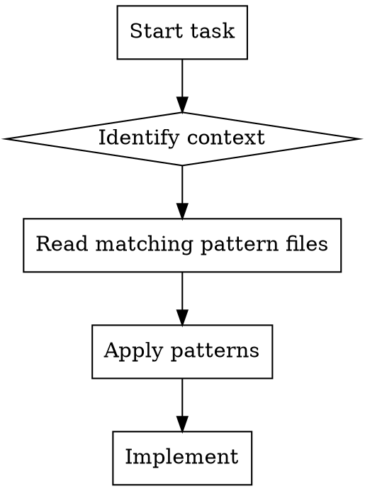

# Check Payload Patterns

## Overview

Before implementing features, load relevant pattern files from `.claude/payload-manual/` based on what you're about to do. This prevents common mistakes by surfacing project-specific patterns contextually.

## When to Use

**Use this skill when:**

- About to implement a feature
- Working across packages
- Adding config components
- Handling translations/labels
- Writing tests
- Refactoring code

## Workflow

### Pattern Loading Table

Use the Read tool to load pattern files based on your task:

| Task Context                   | Pattern Files to Read                                      |
| ------------------------------ | ---------------------------------------------------------- |
| Importing from another package | `.claude/payload-manual/code-quality/monorepo-patterns.md` |
| Creating config components     | `.claude/payload-manual/config/config-patterns.md`         |
| Rendering user-defined labels  | `.claude/payload-manual/config/translation-patterns.md`    |
| Writing tests                  | `.claude/payload-manual/testing/test-patterns.md`          |
| Writing React components       | `.claude/payload-manual/ui/react-patterns.md`              |

**Multiple contexts?** Read all matching files.

### Implementation Steps

1. **Before writing any code**, identify which contexts apply
2. **Use Read tool** to load the matching pattern files (can read multiple in parallel)
3. **Review the patterns** - especially the ❌ Bad / ✅ Good examples
4. **Apply patterns** as you implement
5. **If pattern is missing**, use `/log-pattern` to add it

## Common Mistakes

| Mistake                                | Fix                                      |
| -------------------------------------- | ---------------------------------------- |
| Implement first, check patterns after  | Check BEFORE writing code                |
| Assume you remember the patterns       | Always read the files, patterns evolve   |
| Read only one file when multiple apply | Read ALL matching contexts               |
| Skip reading because task seems simple | Simple tasks violate patterns most often |

## Real-World Impact

Loading patterns before implementing prevents:

- Import path violations that break builds
- Config component errors that break at runtime
- Inconsistent translation handling
- Test pollution
- Violating RSC patterns
