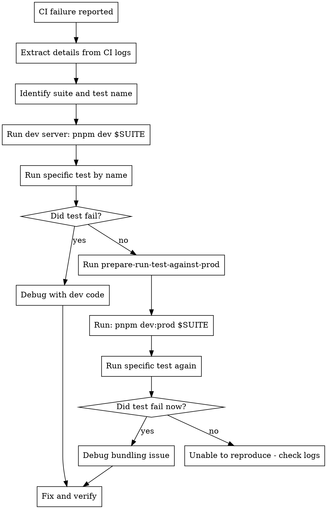

# Triage CI Failure

## Overview

Systematic workflow for triaging and fixing test failures in CI, especially flaky tests that pass locally but fail in CI. Tests that made it to `main` are usually flaky due to timing, bundling, or environment differences.

**CRITICAL RULE: You MUST run the reproduction workflow before proposing any fixes. No exceptions.**

## When to Use

- CI test fails on `main` branch after PR was merged
- Test passes locally but fails in CI
- Test failure labeled as "flaky" or intermittent
- E2E or integration test timing out in CI only

## MANDATORY First Steps

**YOU MUST EXECUTE THESE COMMANDS. Reading code or analyzing logs does NOT count as reproduction.**

1. **Extract** suite name, test name, and error from CI logs
2. **EXECUTE**: Kill port 3000 to avoid conflicts
3. **EXECUTE**: `pnpm dev $SUITE_NAME` (use run_in_background=true)
4. **EXECUTE**: Wait for server to be ready (check with curl or sleep)
5. **EXECUTE**: Run the specific failing test with Playwright directly (npx playwright test test/TEST_SUITE_NAME/e2e.spec.ts:31:3 --headed -g "TEST_DESCRIPTION_TARGET_GOES_HERE")
6. **If test passes**, **EXECUTE**: `pnpm prepare-run-test-against-prod`
7. **EXECUTE**: `pnpm dev:prod $SUITE_NAME` and run test again

**Only after EXECUTING these commands and seeing their output** can you proceed to analysis and fixes.

**"Analysis from logs" is NOT reproduction. You must RUN the commands.**

## Core Workflow



## Step-by-Step Process

### 1. Extract CI Details

From CI logs or GitHub Actions URL, identify:

- **Suite name**: Directory name (e.g., `i18n`, `fields`, `lexical`)
- **Test file**: Full path (e.g., `test/i18n/e2e.spec.ts`)
- **Test name**: Exact test description
- **Error message**: Full stack trace
- **Test type**: E2E (Playwright) or integration (Vitest)

### 2. Reproduce with Dev Code

**CRITICAL: Always run the specific test by name, not the full suite.**

**SERVER MANAGEMENT RULES:**

1. **ALWAYS kill all servers before starting a new one**
2. **NEVER assume ports are free**
3. **ALWAYS wait for server ready confirmation before running tests**

```bash
# ========================================
# STEP 2A: STOP ALL SERVERS
# ========================================
lsof -ti:3000 | xargs kill -9 2>/dev/null || echo "Port 3000 clear"

# ========================================
# STEP 2B: START DEV SERVER
# ========================================
# Start dev server with the suite (in background with run_in_background=true)
pnpm dev $SUITE_NAME

# ========================================
# STEP 2C: WAIT FOR SERVER READY
# ========================================
# Wait for server to be ready (REQUIRED - do not skip)
until curl -s http://localhost:3000/admin > /dev/null 2>&1; do sleep 1; done && echo "Server ready"

# ========================================
# STEP 2D: RUN SPECIFIC TEST
# ========================================
# Run ONLY the specific failing test using Playwright directly
# For E2E tests (DO NOT use pnpm test:e2e as it spawns its own server):
pnpm exec playwright test test/$SUITE_NAME/e2e.spec.ts -g "exact test name"

# For integration tests:
pnpm test:int $SUITE_NAME -t "exact test name"
```

**Did the test fail?**

- ✅ **YES**: You reproduced it! Proceed to debug with dev code.
- ❌ **NO**: Continue to step 3 (bundled code test).

### 3. Reproduce with Bundled Code

If test passed with dev code, the issue is likely in bundled/production code.

**IMPORTANT: You MUST stop the dev server before starting prod server.**

```bash
# ========================================
# STEP 3A: STOP ALL SERVERS (INCLUDING DEV SERVER FROM STEP 2)
# ========================================
lsof -ti:3000 | xargs kill -9 2>/dev/null || echo "Port 3000 clear"

# ========================================
# STEP 3B: BUILD AND PACK FOR PROD
# ========================================
# Build all packages and pack them (this takes time - be patient)
pnpm prepare-run-test-against-prod

# ========================================
# STEP 3C: START PROD SERVER
# ========================================
# Start prod dev server (in background with run_in_background=true)
pnpm dev:prod $SUITE_NAME

# ========================================
# STEP 3D: WAIT FOR SERVER READY
# ========================================
# Wait for server to be ready (REQUIRED - do not skip)
until curl -s http://localhost:3000/admin > /dev/null 2>&1; do sleep 1; done && echo "Server ready"

# ========================================
# STEP 3E: RUN SPECIFIC TEST
# ========================================
# Run the specific test again using Playwright directly
pnpm exec playwright test test/$SUITE_NAME/e2e.spec.ts -g "exact test name"
# OR for integration tests:
pnpm test:int $SUITE_NAME -t "exact test name"
```

**Did the test fail now?**

- ✅ **YES**: Bundling or production build issue. Look for:
  - Missing exports in package.json
  - Build configuration problems
  - Code that behaves differently when bundled
- ❌ **NO**: Unable to reproduce locally. Proceed to step 4.

### 4. Unable to Reproduce

If you cannot reproduce locally after both attempts:

- Review CI logs more carefully for environment differences
- Check for race conditions (run test multiple times: `for i in {1..10}; do pnpm test:e2e...; done`)
- Look for CI-specific constraints (memory, CPU, timing)
- Consider if it's a true race condition that's highly timing-dependent

## Common Flaky Test Patterns

### Race Conditions

- Page navigating while assertions run
- Network requests not settled before assertions
- State updates not completed

**Fix patterns:**

- Use Playwright's web-first assertions (`toBeVisible()`, `toHaveText()`)
- Wait for specific conditions, not arbitrary timeouts
- Use `waitForFunction()` with condition checks

### Test Pollution

- Tests leaving data in database
- Shared state between tests
- Missing cleanup in `afterEach`

**Fix patterns:**

- Track created IDs and clean up in `afterEach`
- Use isolated test data
- Don't use `deleteAll` that affects other tests

### Timing Issues

- `setTimeout`/`sleep` instead of condition-based waiting
- Not waiting for page stability
- Animations/transitions not complete

**Fix patterns:**

- Use `waitForPageStability()` helper
- Wait for specific DOM states
- Use Playwright's built-in waiting mechanisms

## Linting Considerations

When fixing e2e tests, be aware of these eslint rules:

- `playwright/no-networkidle` - Avoid `waitForLoadState('networkidle')` (use condition-based waiting instead)
- `payload/no-wait-function` - Avoid custom `wait()` functions (use Playwright's built-in waits)
- `payload/no-flaky-assertions` - Avoid non-retryable assertions
- `playwright/prefer-web-first-assertions` - Use built-in Playwright assertions

**Existing code may violate these rules** - when adding new code, follow the rules even if existing code doesn't.

## Verification

After fixing:

```bash
# Ensure dev server is running on port 3000
# Run test multiple times to confirm stability
for i in {1..10}; do
  pnpm exec playwright test test/$SUITE_NAME/e2e.spec.ts -g "exact test name" || break
done

# Run full suite
pnpm exec playwright test test/$SUITE_NAME/e2e.spec.ts

# If you modified bundled code, test with prod build
lsof -ti:3000 | xargs kill -9 2>/dev/null
pnpm prepare-run-test-against-prod
pnpm dev:prod $SUITE_NAME
until curl -s http://localhost:3000/admin > /dev/null; do sleep 1; done
pnpm exec playwright test test/$SUITE_NAME/e2e.spec.ts
```

## The Iron Law

**NO FIX WITHOUT REPRODUCTION FIRST**

If you propose a fix before completing steps 1-3 of the workflow, you've violated this skill.

**This applies even when:**

- The fix seems obvious from the logs
- You've seen this error before
- Time pressure from the team
- You're confident about the root cause
- The logs show clear stack traces

**No exceptions. Run the reproduction workflow first.**

## Rationalization Table

Every excuse for skipping reproduction, and why it's wrong:

| Rationalization                      | Reality                                        |
| ------------------------------------ | ---------------------------------------------- |
| "The logs show the exact error"      | Logs show symptoms, not root cause. Reproduce. |
| "I can see the problem in the code"  | You're guessing. Reproduce to confirm.         |
| "This is obviously a race condition" | Maybe. Reproduce to be sure.                   |
| "I've seen this error before"        | This might be different. Reproduce.            |
| "The stack trace is clear"           | Stack trace shows where, not why. Reproduce.   |
| "Time pressure - need to fix fast"   | Reproducing IS fast. Guessing wastes time.     |
| "The test file shows the issue"      | Reading ≠ running. Execute the commands.       |
| "I'll analyze the code first"        | Code analysis comes AFTER reproduction.        |
| "Let me investigate the root cause"  | Reproduction IS the investigation.             |
| "I need to understand the error"     | Understanding comes from seeing it fail.       |

## Red Flags - STOP

These thoughts mean you're about to violate the skill:

- "Let me just fix the obvious issue" → STOP. Execute reproduction first.
- "I'll increase the timeout" → STOP. Find root cause via reproduction.
- "This looks like X from the logs" → STOP. Run the test.
- "I'll run the full suite" → STOP. Run specific test first.
- "Let me check the code" → STOP. Run reproduction first.
- "I can see the problem in the stack trace" → STOP. Reproduce to confirm.
- "The logs are clear enough" → STOP. Execute the commands.
- "Let me analyze..." → STOP. Analysis comes after reproduction.

**All of these mean: Stop immediately. Execute the reproduction commands. No analysis without execution.**

## Example Session

**CORRECT approach - executes commands first:**

```
User: CI failed on i18n suite - https://github.com/.../actions/runs/XXX

Agent:
1. Extracted details from CI logs:
   - Suite: i18n
   - Test: "ensure translations update correctly when switching language"
   - File: test/i18n/e2e.spec.ts:124
   - Error: "Error loading language: en" TypeError: network error

2. Executing reproduction workflow:
   [Uses Bash tool to kill ports]
   $ lsof -ti:3000 | xargs kill -9 2>/dev/null || echo "Port 3000 clear"

   [Uses Bash tool with run_in_background=true]
   $ pnpm dev i18n

   [Waits for server to start with curl check]
   $ until curl -s http://localhost:3000/admin > /dev/null; do sleep 1; done && echo "Server ready"

   [Uses Bash tool to run Playwright directly]
   $ pnpm exec playwright test test/i18n/e2e.spec.ts -g "ensure translations update correctly when switching language"

   Output shows: Test PASSED locally

3. Test passed with dev code, trying bundled code:
   [Kills ports again]
   $ lsof -ti:3000 | xargs kill -9 2>/dev/null

   [Uses Bash tool]
   $ pnpm prepare-run-test-against-prod

   [Uses Bash tool with run_in_background=true]
   $ pnpm dev:prod i18n

   [Waits for server]
   $ until curl -s http://localhost:3000/admin > /dev/null; do sleep 1; done

   [Uses Bash tool]
   $ pnpm exec playwright test test/i18n/e2e.spec.ts -g "ensure translations update correctly when switching language"

   Output shows: Test FAILED - reproduced!

4. Now that I've reproduced it, analyzing the failure...
   [Code analysis, root cause identification]

5. Implementing fix: [specific changes]

6. Verification:
   [Uses Bash tool]
   $ for i in {1..10}; do pnpm test:e2e i18n -g "exact test"; done
   All 10 runs passed!
```

**INCORRECT approach - analyzes without executing:**

```
User: CI failed on i18n suite

Agent: Looking at the error logs, I can see this is a race condition...
[Analyzes code, proposes fix without running any commands]

❌ WRONG - This violates the skill. Must execute reproduction commands first.
```

## Common Mistakes

| Mistake                           | Fix                                                      |
| --------------------------------- | -------------------------------------------------------- |
| Running full test suite first     | Run specific test by name                                |
| Skipping dev code reproduction    | Always try dev code first                                |
| Not testing with bundled code     | If dev passes, test with `prepare-run-test-against-prod` |
| Proposing fix without reproducing | Follow the workflow - reproduce first                    |
| Using `networkidle` in new code   | Use condition-based waiting with `waitForFunction()`     |
| Adding arbitrary `wait()` calls   | Use Playwright's built-in assertions and waits           |

## Key Principles

1. **Reproduce before fixing**: Never propose a fix without reproducing the issue
2. **Test specifically**: Run the exact failing test, not the full suite
3. **Dev first, prod second**: Check dev code before bundled code
4. **Follow the workflow**: No shortcuts - the steps exist to save time
5. **Verify stability**: Run tests multiple times to confirm fix

## Completion: Creating a PR

**After you have:**

1. ✅ Reproduced the issue
2. ✅ Implemented a fix
3. ✅ Verified the fix passes locally (multiple runs)
4. ✅ Tested with prod build (if applicable)

**You MUST prompt the user to create a PR:**

```
The fix has been verified and is ready for review. Would you like me to create a PR with these changes?

Summary of changes:
- [List files modified]
- [Brief description of the fix]
- [Verification results]
```

**IMPORTANT:**

- **DO NOT automatically create a PR** - always ask the user first
- Provide a clear summary of what was changed and why
- Include verification results (number of test runs, pass rate)
- Let the user decide whether to create the PR immediately or make additional changes first

This ensures the user has visibility and control over what gets submitted for review.
