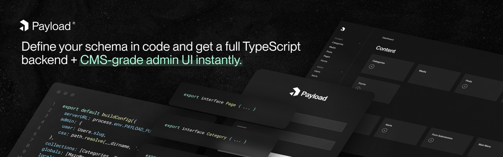

<a href="https://payloadcms.com">
  
</a>
<br />
<br />
<p align="left">
  <a href="https://github.com/payloadcms/payload/actions">
    
  </a>
  &nbsp;
  <a href="https://discord.gg/payload">
    
  </a>
  &nbsp;
  <a href="https://www.npmjs.com/package/payload">
    
  </a>
  &nbsp;
  <a href="https://twitter.com/payloadcms">
    
  </a>
</p>
<hr/>
<h4>
<a target="_blank" href="https://payloadcms.com/docs/getting-started/what-is-payload" rel="dofollow"><strong>Explore the Docs</strong></a>&nbsp;·&nbsp;<a target="_blank" href="https://payloadcms.com/community-help" rel="dofollow"><strong>Community Help</strong></a>&nbsp;·&nbsp;<a target="_blank" href="https://demo.payloadcms.com/" rel="dofollow"><strong>Try Live Demo</strong></a>&nbsp;·&nbsp;<a target="_blank" href="https://github.com/payloadcms/payload/discussions/1539" rel="dofollow"><strong>Roadmap</strong></a>&nbsp;·&nbsp;<a target="_blank" href="https://www.g2.com/products/payload-cms/reviews#reviews" rel="dofollow"><strong>View G2 Reviews</strong></a>
</h4>
<hr/>
<h3>Benefits over a regular CMS</h3>
<ul>
  <li>Don’t hit some third-party SaaS API, hit your own API</li>
  <li>Use your own database and own your data</li>
  <li>It's just Express - do what you want outside of Payload</li>
  <li>No need to learn how Payload works - if you know JS, you know Payload</li>
  <li>No vendor lock-in</li>
  <li>Avoid microservices hell - get everything (even auth) in one place</li>
  <li>Never touch ancient WP code again</li>
  <li>Build faster, never hit a roadblock</li>
  <li>Both admin and backend are 100% extensible</li>
</ul>

## ☁️ Deploy instantly with Payload Cloud.
Create a cloud account, connect your GitHub, and [deploy in minutes](https://payloadcms.com/new).

## 🚀 Get started by self-hosting completely free, forever.

Before beginning to work with Payload, make sure you have all of the [required software](https://payloadcms.com/docs/getting-started/installation).

```text
npx create-payload-app
```

Alternatively, it only takes about five minutes to [create an app from scratch](https://payloadcms.com/docs/getting-started/installation#from-scratch).

## 🖱️ One-click templates
### 🛒 [E-Commerce](https://github.com/payloadcms/payload/tree/master/templates/ecommerce)
Eliminate the need to combine Shopify and a CMS, and instead do it all with Payload + Stripe. Best of all, you can extend it as much as you need.

[All Official Templates](https://github.com/orgs/payloadcms/repositories?q=topic%3Apayload-template)&nbsp;·&nbsp;[Community Templates](https://github.com/topics/payload-template)

**If you maintain your own template, consider adding the `payload-template` topic to your GitHub repository for others to find.**

## ✨ Features

- Completely free and open-source
- [GraphQL](https://payloadcms.com/docs/graphql/overview), [REST](https://payloadcms.com/docs/rest-api/overview), and [Local](https://payloadcms.com/docs/local-api/overview) APIs
- [Easily customizable ReactJS Admin](https://payloadcms.com/docs/admin/overview)
- [Fully self-hosted](https://payloadcms.com/docs/production/deployment)
- [Extensible Authentication](https://payloadcms.com/docs/authentication/overview)
- [Local file storage & upload](https://payloadcms.com/docs/upload/overview)
- [Version History and Drafts](https://payloadcms.com/docs/versions/overview)
- [Field-based Localization](https://payloadcms.com/docs/configuration/localization)
- [Block-based Layout Builder](https://payloadcms.com/docs/fields/blocks)
- [Extensible SlateJS rich text editor](https://payloadcms.com/docs/fields/rich-text)
- [Array field type](https://payloadcms.com/docs/fields/array)
- [Field conditional logic](https://payloadcms.com/docs/fields/overview#conditional-logic)
- Extremely granular [Access Control](https://payloadcms.com/docs/access-control/overview)
- [Document and field-level hooks](https://payloadcms.com/docs/hooks/overview) for every action Payload provides
- Built with Typescript & very Typescript-friendly
- Intensely fast API
- Highly secure thanks to HTTP-only cookies, CSRF protection, and more

<a target="_blank" href="https://github.com/payloadcms/payload/discussions"><strong>Request Feature</strong></a>

## 🗒️ Documentation

Check out the [Payload website](https://payloadcms.com/docs/getting-started/what-is-payload) to find in-depth documentation for everything that Payload offers.

## 🙋 Contributing

If you want to add contributions to this repository, please follow the instructions in [contributing.md](./contributing.md).

## 📚 Examples

The examples directory is a great resource for learning how to setup Payload in a variety of different ways.

[Examples Directory](./examples)

## 🔌 Plugins

Payload is highly extensible and allows you to install or distribute plugins that add or remove functionality. There are both officially-supported and community-supported plugins available. If you maintain your own plugin, consider adding the `payload-plugin` topic to your GitHub repository for others to find.

- [Official Plugins](https://github.com/orgs/payloadcms/repositories?q=topic%3Apayload-plugin)
- [Community Plugins](https://github.com/topics/payload-plugin)

## 🚨 Need help?

There are lots of good conversations and resources in our Github Discussions board and our Discord Server. If you're struggling with something, chances are, someone's already solved what you're up against. :point_down:

- [GitHub Discussions](https://github.com/payloadcms/payload/discussions)
- [GitHub Issues](https://github.com/payloadcms/payload/issues)
- [Discord](https://t.co/30APlsQUPB)
- [Community Help](https://payloadcms.com/community-help)

## ⭐ Like what we're doing? Give us a star


## 👏 Thanks to all our contributors


