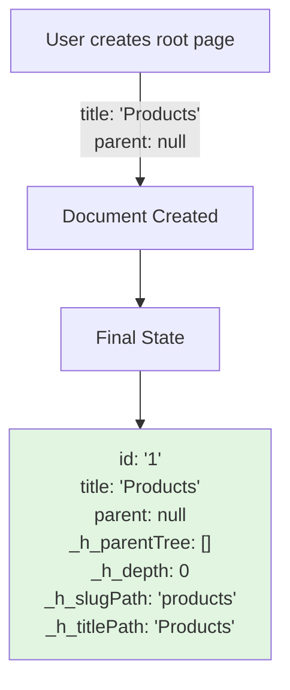
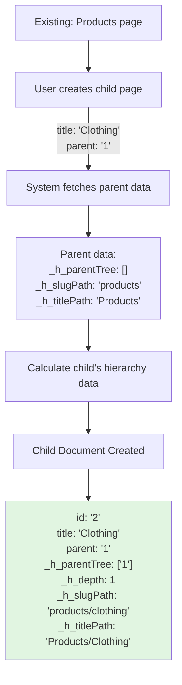
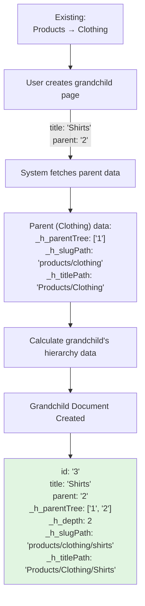
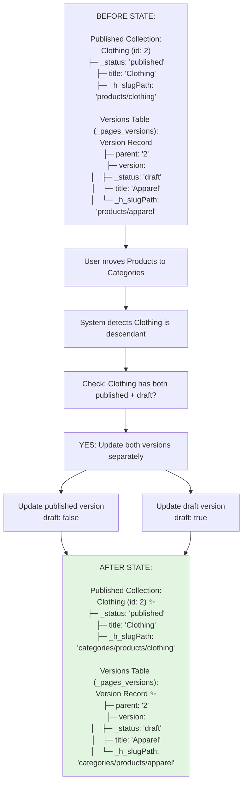
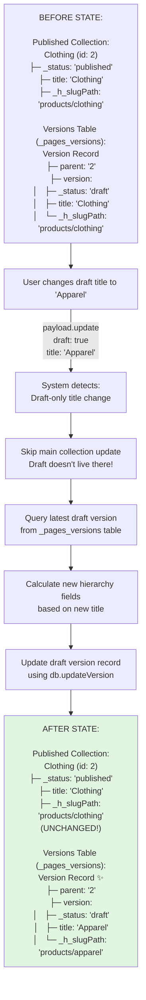

# Hierarchy Data Flows

High-level visual diagrams showing how hierarchy data is created and maintained.

## Flow 1: Creating a Root Page

**What happens:**

- Document created with no parent → root document
- `_h_parentTree` is empty array (no ancestors)
- `_h_depth` is 0 (root level)
- Paths are just the slugified/actual title

---

## Flow 2: Creating a Child Page

**What happens:**

- System fetches parent's hierarchy data
- `_h_parentTree` = parent's tree + parent ID = `['1']`
- `_h_depth` = length of tree = `1`
- Paths = parent path + `/` + child slug/title

---

## Flow 3: Creating a Grandchild Page

**What happens:**

- System fetches parent (Clothing) hierarchy data
- `_h_parentTree` = parent's tree + parent ID = `['1', '2']`
- `_h_depth` = length of tree = `2`
- Paths = parent path + `/` + grandchild slug/title

---

## Flow 4: Moving a Child to Another Parent

```mermaid
graph TD
    A["BEFORE STATE:<br/><br/>Categories (id: 4)<br/>├─ parent: null<br/>├─ _h_parentTree: []<br/>├─ _h_slugPath: 'categories'<br/><br/>Products (id: 1)<br/>├─ parent: null<br/>├─ _h_parentTree: []<br/>├─ _h_slugPath: 'products'<br/><br/>Clothing (id: 2)<br/>├─ parent: '1'<br/>├─ _h_parentTree: ['1']<br/>├─ _h_slugPath: 'products/clothing'<br/><br/>Shirts (id: 3)<br/>├─ parent: '2'<br/>├─ _h_parentTree: ['1', '2']<br/>├─ _h_slugPath: 'products/clothing/shirts'"]

    A --> B[User moves Clothing<br/>from Products to Categories]

    B -->|Update Clothing:<br/>parent: '4'| C[System detects parent change]

    C --> D[Fetch new parent data]

    D --> E["Categories data:<br/>_h_parentTree: []<br/>_h_slugPath: 'categories'"]

    E --> F[Update Clothing document]

    F --> G[Find all descendants of Clothing]

    G --> H["Found: Shirts (id: 3)<br/>Current: _h_parentTree: ['1', '2']<br/>Current: _h_slugPath: 'products/clothing/shirts'"]

    H --> I[Update Shirts with new tree data]

    I --> J["AFTER STATE:<br/><br/>Categories (id: 4)<br/>├─ parent: null<br/>├─ _h_parentTree: []<br/>├─ _h_slugPath: 'categories'<br/><br/>Products (id: 1)<br/>├─ parent: null<br/>├─ _h_parentTree: []<br/>├─ _h_slugPath: 'products'<br/><br/>Clothing (id: 2) ✨<br/>├─ parent: '4'<br/>├─ _h_parentTree: ['4']<br/>├─ _h_slugPath: 'categories/clothing'<br/><br/>Shirts (id: 3) ✨<br/>├─ parent: '2' (unchanged!)<br/>├─ _h_parentTree: ['4', '2']<br/>├─ _h_slugPath: 'categories/clothing/shirts'"]

    style J fill:#e1f5e1
```

**What happens:**

1. **Clothing is updated:**

   - `parent` changes from `'1'` → `'4'`
   - `_h_parentTree` changes from `[]` → `['4']`
   - `_h_slugPath` changes from `'products/clothing'` → `'categories/clothing'`

2. **System finds descendants:**

   - Query: `where: { _h_parentTree: { in: ['2'] } }`
   - Found: Shirts (has `'2'` in its tree)

3. **Shirts is updated (IMPORTANT: parent field stays '2'):**
   - `parent` stays `'2'` (Shirts is still under Clothing!)
   - `_h_parentTree` changes from `['1', '2']` → `['4', '2']`
   - `_h_slugPath` changes from `'products/clothing/shirts'` → `'categories/clothing/shirts'`

**Key insight:** Descendants don't change their immediate parent, only their ancestor tree and paths are updated to reflect the new location in the hierarchy.

---

## Flow 5: Moving with Draft Versions

**What happens:**

1. **System queries both versions:**

   - Published: `payload.find({ draft: false })` → Gets published Clothing
   - Draft: `payload.find({ draft: true })` → Gets draft Clothing

2. **Both versions are updated separately:**

   - Published update uses published title: `'categories/products/clothing'`
   - Draft update uses draft title: `'categories/products/apparel'`

3. **Each version maintains its own path:**
   - Published path based on published data
   - Draft path based on draft data
   - Both are in sync with new parent location

---

## Flow 6: Draft-Only Title Change

**What happens:**

1. **System skips main collection:**

   - Draft documents don't live in main collection
   - Only versions table needs updating

2. **Query draft version:**

   - Find latest version record where `version._status === 'draft'`

3. **Update version record directly:**
   - Use `db.updateVersion()` to write to versions table
   - Update `version.version._h_slugPath` based on new draft title
   - Published version remains unchanged

**Key insight:** Draft-only changes only affect the versions table, not the main collection. This ensures draft and published versions can have independent paths.
