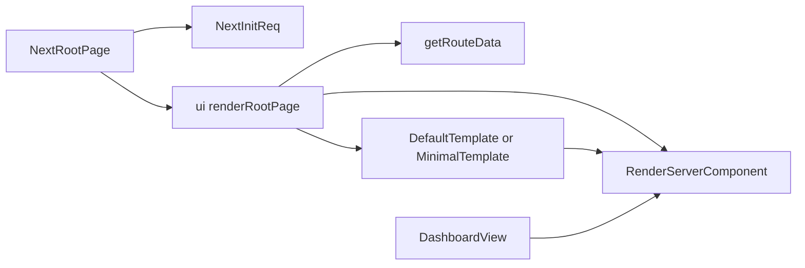
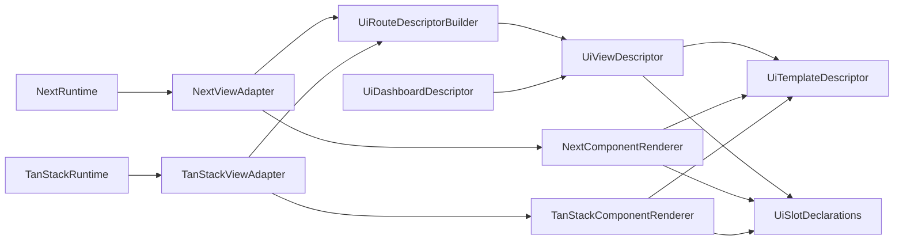

# UI Framework-Agnostic Views

## Goal

Move shared admin view logic toward a framework-agnostic layer in `@payloadcms/ui`, while moving Next-specific request, routing, and React Server Component behavior into `@payloadcms/next`.

This document supersedes the recent TanStack-specific client-shell direction from:

- `docs/plans/2026-04-02-tanstack-start-client-rendering.md`
- `docs/plans/2026-04-02-tanstack-start-client-rendering-plan.md`

Those documents assumed the right answer was to add a TanStack-only page shell beside the existing Next path. The better direction is to make the shared admin view layer portable first, then let each framework package provide its own runtime wrapper.

## Why The Previous Direction Is Wrong

The recent TanStack work correctly identified that the current `ui` admin rendering path is not safely consumable by an isomorphic route graph, but it pushed the fix too far into `packages/tanstack-start`.

That approach has two problems:

1. It duplicates admin view and template behavior in a second package instead of fixing the boundary in the shared layer.
2. It preserves the assumption that Next keeps the "real" admin path and other frameworks must adapt around it with client-only substitutes.

If `@payloadcms/ui` is truly the shared admin UI package, it should own the framework-agnostic view contracts and composition rules. `@payloadcms/next` should own the Next-specific runtime and RSC integration.

## Verified Current Boundary Problem

### Shared `ui` still owns framework-shaped rendering

`packages/ui/src/views/Root/RenderRoot.tsx` is described as framework-agnostic, but it still owns:

- route-to-view orchestration
- auth redirects
- template selection
- direct rendering of payload components through `RenderServerComponent`

`packages/ui/src/views/Dashboard/index.tsx` is also not just a shared dashboard view. It currently mixes:

- request-bound data fetches like `getGlobalData(req)`
- server props assembly
- `RenderServerComponent` invocation for dashboard component resolution

### `RenderServerComponent` is the hidden framework seam

`packages/ui/src/elements/RenderServerComponent/index.tsx` currently decides:

- how `PayloadComponent` values are resolved from the import map
- whether a resolved component is treated as an RSC-like server component
- when `serverProps` are merged into the render call

That is the main coupling point between:

- shared view and template description in `ui`
- framework-specific server rendering behavior

### `ui` still contains Next-specific assumptions

The clearest example is `packages/ui/src/elements/Link/index.tsx`, which imports `next/link.js` directly. That means `ui` still embeds a runtime-specific navigation primitive instead of consuming an adapter-provided one.

## Current Layering



Today, `packages/next` is mostly a wrapper around a rendering model that still lives in `ui`.

That is backward for a portable architecture.

## Target Architecture



In the target state:

- `@payloadcms/ui` defines route resolution, shared view descriptors, template contracts, slot declarations, and dashboard behavior.
- `@payloadcms/next` owns Next request initialization, `redirect` / `notFound`, server actions, `next/navigation`, document shell wiring, and RSC-aware component rendering.
- `@payloadcms/tanstack-start` consumes the same shared descriptors through its own runtime adapter instead of recreating view/template logic.

## Boundary Rules

### `@payloadcms/ui` should own

- route and view descriptors
- template and slot contracts
- shared dashboard view composition
- synchronous shared root/bootstrap composition
- framework-neutral router interfaces and provider contracts
- framework-neutral component resolution interfaces

### `@payloadcms/next` should own

- `initReq` built on `next/headers`
- `redirect` / `notFound`
- Next-specific invocation transport such as server actions, route handlers, and cookie writes
- `next/navigation` router integration
- `next/link` integration
- async request-bound execution needed to prepare root/bootstrap inputs for RSC
- RSC-aware payload component execution
- app-router document shell concerns

### `@payloadcms/tanstack-start` should own

- TanStack route loaders, server functions, or REST wiring
- TanStack router integration
- TanStack-specific request/runtime adapters
- use of shared `ui` descriptors instead of placeholder templates or duplicate views

### Reusable server-side logic vs framework transport

`@payloadcms/ui` can still own reusable admin-side logic that happens to run on the server. The important boundary is not "server code vs client code." The important boundary is "shared Payload/business logic vs framework-specific execution transport."

That means shared files such as:

- `packages/ui/src/utilities/copyDataFromLocale.ts`
- `packages/ui/src/utilities/buildFormState.ts`
- `packages/ui/src/utilities/buildTableState.ts`
- `packages/ui/src/utilities/slugify.ts`

can remain in `ui` when they provide reusable logic like:

- Payload Local API reads/writes
- access checks and permission-aware data shaping
- shared result formatting or merge logic
- framework-neutral request-aware helpers that accept `req`

What should not be locked into `ui` is a Next-shaped execution model for invoking that logic.

The adapter packages should own how shared logic is exposed to their runtime:

- `@payloadcms/next` can call it through a Next server action, route handler, or RSC wrapper
- `@payloadcms/tanstack-start` can call it through a loader, server function, or plain REST request
- another framework might skip server actions entirely and call the same shared logic through a REST API endpoint

So the long-term contract should be:

1. keep reusable logic in `ui` where it is genuinely framework-agnostic
2. keep framework transport and runtime wiring in the adapter package
3. avoid making "server actions" themselves the shared primitive, because some frameworks will not support that concept at all

## Root Bootstrap Boundary Correction

The immediate target is not "fix nav." The immediate target is to fix the root/bootstrap components without which another framework cannot even load the first admin page.

The shared layer currently still mixes two different concerns inside those bootstrap paths:

- synchronous shared composition
- request/runtime-specific async execution

That split should be inverted.

### What counts as a root/bootstrap component

For this phase, "root/bootstrap" means the components and helpers that are required to decide, assemble, and render the very first admin page shell at all. That includes things like:

- root route/view orchestration
- template selection and shell assembly
- root-level slot preparation
- framework-specific component execution needed by that first page

`packages/ui/src/elements/Nav/index.tsx` is only an example of the problem, because it sits on the first-page path and currently mixes shared composition with request-bound async work. It is not the whole target by itself.

### Target shape for root/bootstrap

The shared `ui` entries on the first-page path should move toward synchronous composition layers that accept already-resolved inputs.

In practice, that means `ui` should own things like:

- root descriptors
- template/shell composition
- already-grouped or already-resolved root UI inputs
- framework-neutral slot/component specifications

And the framework package should own the async wrapper above them.

### What `next` should do instead

If Next needs async behavior for RSC, that async boundary should live in `@payloadcms/next`, not in the shared `ui` bootstrap components.

That Next wrapper should be responsible for:

- loading request-bound state needed to render the first page
- resolving any RSC/server-rendered root slots
- passing the fully resolved props into the synchronous shared `ui` bootstrap entries

This is the same broader rule as the rest of the document: `ui` describes and composes, while `next` performs request-bound async execution.

### What TanStack should do instead

TanStack should consume the same synchronous shared bootstrap contracts using its own runtime state and router bindings.

It should not require `ui` to accumulate adapter-motivated helper leaves that are only useful because the shared root/bootstrap boundary is still in the wrong place.

If a helper like `packages/ui/src/elements/Nav/AdminNavLinks.tsx` exists during migration, it should be treated as transitional unless it becomes part of the canonical shared path that the main `ui` bootstrap components themselves use.

## Renderer Boundary Proposal

The current `RenderServerComponent` API is too concrete. It renders immediately and embeds framework behavior in the shared layer.

The first architectural step should be to replace "render now" with "describe what must be rendered."

### Proposed split

1. Keep import-map and payload-component concepts in `ui`, but stop coupling them directly to a framework rendering decision.
2. Introduce a renderer boundary that can be implemented by `next` first and by TanStack later.

### Proposed shared types

```ts
type ViewComponentSpec = {
  component?: PayloadComponent | React.ComponentType
  fallback?: React.ComponentType
  clientProps?: object
  serverProps?: object
}

type ViewSlotSpec = {
  key: string
  spec: ViewComponentSpec
}

type FrameworkViewRenderer = {
  renderComponent: (spec: ViewComponentSpec) => React.ReactNode
  renderSlots: (specs: ViewSlotSpec[]) => Record<string, React.ReactNode>
}
```

This is intentionally small.

The important shift is:

- `ui` produces `ViewComponentSpec` and `ViewSlotSpec`
- the framework adapter decides how to execute them

### What changes in `ui`

The following files should stop invoking rendering directly and instead produce shared declarations or consume an injected renderer:

- `packages/ui/src/elements/RenderServerComponent/index.tsx`
- `packages/ui/src/views/Root/RenderRoot.tsx`
- `packages/ui/src/templates/Default/index.tsx`
- `packages/ui/src/views/Dashboard/index.tsx`

### What changes in `next`

`packages/next` should own the first renderer implementation for the new boundary.

That implementation should preserve current behavior by continuing to:

- resolve payload components through the import map
- detect RSC/server component behavior where needed
- merge server props only in the Next runtime

## Root Refactor: Shared Descriptor + Framework Wrapper

The current `renderRootPage` path should be split in two layers.

### Shared `ui` layer

The `ui` layer should build a root-level descriptor from:

- `getRouteData`
- auth/public-route decisions
- visible entities
- client config
- template selection
- slot/component specifications

The output should be a structured description of what the page is, not an already-rendered tree.

### Framework wrapper layer

The framework package should provide:

- request initialization
- framework redirects and not-found behavior
- renderer implementation
- final page/tree assembly

For Next, this means `packages/next/src/views/Root/index.tsx` becomes a true adapter entrypoint instead of a thin passthrough to a monolithic `ui` renderer.

## Root-First Migration Slice

The first implementation slice should prove the architecture with only the root/bootstrap components required to load the first admin page.

### Scope

Included:

- root descriptor boundary
- renderer abstraction
- root/bootstrap shell migration
- Next adapter ownership of async/RSC execution for this slice

Deferred:

- dashboard-specific cleanup beyond what the first page needs
- nav-specific cleanup beyond what the first page needs
- auth and minimal-template views like login / forgot / reset / logout / verify / unauthorized / create-first-user
- list, browse-by-folder, and collection-folder rendering
- document, edit, account, API, version, and versions rendering
- splitting TanStack view ownership into per-view modules that mirror the existing Next view tree
- full template cleanup
- broader custom-view support

### Why Root First

Until the root/bootstrap boundary is corrected, another framework still cannot reliably load the first page without inheriting Next-shaped assumptions from `ui`.

That makes the first-page path the highest-leverage proving slice because it exercises:

- route selection from `getRouteData`
- template composition
- root shell assembly
- root-level slot/component execution
- request/runtime handoff between `ui` and the framework package

### Root target shape

The first target is not "finish dashboard" or "finish nav." The first target is to make the root/bootstrap path loadable through a shared synchronous composition contract with adapter-owned async execution above it.

Instead, it should move toward:

1. shared root/bootstrap descriptor or composition in `ui`
2. renderer-driven execution of root component specs in the framework package
3. Next preserving current behavior through its adapter implementation
4. the same descriptor/adapter pattern being applied view-by-view after the bootstrap path is stable
5. TanStack moving from a monolithic admin page file to per-view adapter entrypoints that are easy to compare against `packages/next/src/views`

## Next-Specific Ownership To Expand

The following `next` files already sit near the correct boundary and should continue moving in that direction:

- `packages/next/src/layouts/Root/index.tsx`
- `packages/next/src/views/Root/index.tsx`
- `packages/next/src/adapter/RouterProvider.tsx`
- `packages/next/src/utilities/initReq.ts`

In addition, root/bootstrap primitives currently embedded in `ui` should move behind adapter-owned async wrappers where necessary, starting with:

- `packages/ui/src/elements/Link/index.tsx`
- the async/request-bound pieces currently mixed into root-path components like `packages/ui/src/elements/Nav/index.tsx`
- other `ui` root/template/bootstrap entries that are currently `async` only because they perform Next-shaped request work

The long-term goal is that `ui` consumes only framework-neutral router context, while `next` and TanStack each provide their own `Link`, pathname, search-params, and router operations through adapter wiring.

## Immediate Follow-Through: Collapse `TanStackAdminPage` Into Per-View Adapters

Once the root/bootstrap boundary exists, the next TanStack step should not be to keep extending `packages/tanstack-start/src/views/TanStackAdminPage.tsx` as a parallel admin implementation.

That file is now the main duplication hotspot. It already re-implements:

- default template composition through `TanStackDefaultTemplate`
- dashboard composition through `DashboardView`
- auth/minimal-template views like `LoginView`, `ForgotPasswordView`, `ResetPasswordView`, `LogoutView`, `VerifyView`, `UnauthorizedView`, and `CreateFirstUserView`
- account/document-edit composition through `AccountView`
- list state + rendering through `useListState` and `ListView`
- document state + rendering through `useDocumentState` and `DocumentView`
- top-level view selection through a TanStack-only `renderView` switch

At the same time, TanStack server state is already leaning on shared `ui` internals in:

- `packages/tanstack-start/src/views/Root/getPageState.ts`
- `packages/tanstack-start/src/views/Root/serverFunctions.ts`

That means the next architectural payoff is not another TanStack-only wrapper. It is to first finish turning the shared root/bootstrap `ui` paths into adapter-consumable contracts, then delete the matching custom branches from `TanStackAdminPage.tsx` view by view.

### Target shape

`TanStackAdminPage.tsx` should not remain the long-term home for every TanStack admin view. The target should look much closer to `packages/next/src/views`, with TanStack view entrypoints split by view type instead of centralized behind one switch.

It should either disappear entirely or shrink to a tiny route-level handoff that owns only:

1. TanStack runtime providers and router bindings
2. handoff from serialized page/server-function state into shared `ui` view entrypoints
3. adapter-specific renderer execution for payload component slots
4. temporary unsupported fallbacks only where the shared contract does not exist yet

It should stop owning bespoke template markup or hand-maintained root/dashboard/auth/list/document/account wrappers once the shared contracts are available.

### Target TanStack view structure

TanStack should move toward a per-view folder layout similar to Next so adapter boundaries are explicit and comparable:

```text
packages/tanstack-start/src/views/
  Root/
    index.tsx
    getPageState.ts
    serverFunctions.ts
    types.ts
  Dashboard/
    index.tsx
  Login/
    index.tsx
  ForgotPassword/
    index.tsx
  ResetPassword/
    index.tsx
  Logout/
    index.tsx
  Verify/
    index.tsx
  Unauthorized/
    index.tsx
  CreateFirstUser/
    index.tsx
  List/
    index.tsx
  Document/
    index.tsx
  Account/
    index.tsx
  Versions/
    index.tsx
  Version/
    index.tsx
```

This does not mean TanStack must copy every Next file 1:1. It means the folder structure should communicate the same architecture: one adapter entrypoint per view, shared `ui` contracts underneath, and no single "big ass file" that owns the whole admin surface.

### Required shared extractions

To make that collapse possible, the shared layer needs adapter-facing entrypoints that TanStack can consume without copying behavior:

- root/bootstrap contracts that let TanStack load the first page without depending on async `ui` entrypoints
- template contracts that let TanStack use shared default/minimal composition instead of `TanStackDefaultTemplate`
- dashboard descriptor/state helpers that replace the current client-only `DashboardView`
- auth/minimal-view entrypoints for login, forgot-password, reset-password, logout, verify, unauthorized, and create-first-user flows
- list descriptor/state builders that replace the TanStack-specific `table-state` -> `DefaultListView` bridge
- browse/folder view contracts where TanStack currently needs collection-specific route handling
- document, edit, and account descriptor/state builders that replace the TanStack-specific `tanstack-document-state` -> `DefaultEditView` bridge
- version and versions contracts so edit-related subviews also follow the same adapter boundary
- a supported custom-view contract only after the core built-in views have stopped depending on framework-specific rendering in `ui`

The important constraint is that these should be shared `ui` contracts, not TanStack-specific forks of `renderListView` or `renderDocument`.

For root/bootstrap specifically, the target is not "extract another helper from `ui` because TanStack needs it." The target is to make the main shared first-page path adapter-consumable, with Next owning any async wrapper above it.

### Collapse order

1. identify the root/bootstrap `ui` components required to load the first admin page
2. move async/request-bound work for those components into `packages/next` wrappers
3. make the shared `ui` bootstrap path synchronous and adapter-consumable
4. route TanStack first-page loading through those same shared root/bootstrap contracts
5. split the simplest TanStack views into per-view adapters first, starting with auth/minimal-template views that already map cleanly to Next folders
6. apply the same extraction pattern to dashboard, list, browse/folder, document/edit, account, version, and versions views
7. reduce any remaining TanStack root dispatcher to a thin handoff over per-view entrypoints instead of a second admin implementation

### Likely touchpoints for this follow-through

- `packages/tanstack-start/src/views/TanStackAdminPage.tsx`
- new TanStack view folders under `packages/tanstack-start/src/views/*`
- `packages/ui/src/views/Root/RenderRoot.tsx`
- `packages/ui/src/elements/RenderServerComponent/index.tsx`
- `packages/ui/src/elements/Nav/index.tsx`
- `packages/ui/src/elements/Nav/index.client.tsx`
- `packages/tanstack-start/src/views/Root/getPageState.ts`
- `packages/tanstack-start/src/views/Root/serverFunctions.ts`
- `packages/tanstack-start/src/views/Root/types.ts`
- `packages/next/src/views/Root/index.tsx`
- `packages/next/src/layouts/Root/index.tsx`
- `packages/ui/src/templates/Default/index.tsx`
- `packages/ui/src/templates/Minimal/index.tsx`
- `packages/next/src/views/Login/index.tsx`
- `packages/next/src/views/List/index.tsx`
- `packages/next/src/views/Document/index.tsx`
- `packages/next/src/views/Account/index.tsx`

## Deferred Follow-Up Phases

### Phase 2: Auth And Minimal Views

Apply the same pattern to the simpler built-in views first so TanStack stops routing them through one monolith:

- shared auth/minimal view contracts in `ui`
- framework redirects, router integration, and runtime-specific execution in the adapter package
- TanStack view folders for login, forgot-password, reset-password, logout, verify, unauthorized, and create-first-user

Likely touchpoints:

- `packages/ui/src/views/Login`
- `packages/ui/src/views/ForgotPassword`
- `packages/ui/src/views/ResetPassword`
- `packages/ui/src/views/Logout`
- `packages/ui/src/views/Verify`
- `packages/next/src/views/Login/index.tsx`
- `packages/tanstack-start/src/views/Login/index.tsx`

### Phase 3: Dashboard, List, And Folder Views

Apply the same pattern to the main collection navigation surface by separating:

- shared dashboard/list/folder descriptors and slot declarations in `ui`
- framework rendering and request/runtime behavior in the adapter package
- per-view TanStack adapters instead of inline branches inside a single page component

Likely touchpoints:

- `packages/ui/src/views/Dashboard/index.tsx`
- `packages/ui/src/views/List/RenderListView.tsx`
- `packages/ui/src/views/List/renderListViewSlots.tsx`
- `packages/next/src/views/Dashboard/index.tsx`
- `packages/next/src/views/List/index.tsx`
- `packages/next/src/views/BrowseByFolder/buildView.tsx`
- `packages/next/src/views/CollectionFolders/buildView.tsx`

### Phase 4: Document, Edit, Account, And Version Views

Apply the same pattern to edit-heavy views by separating:

- shared document/account/version descriptors and composition rules in `ui`
- framework execution of payload components, server data, and edit-specific runtime behavior in the adapter package
- TanStack adapters for document, account, version, and versions views that mirror Next's high-level structure

Likely touchpoints:

- `packages/ui/src/views/Document/RenderDocument.tsx`
- `packages/ui/src/views/Document/renderDocumentSlots.tsx`
- `packages/next/src/views/Document/index.tsx`
- `packages/next/src/views/Account/index.tsx`
- `packages/next/src/views/Version`
- `packages/next/src/views/Versions`

### Phase 5: Templates And Custom Views

After the built-in view boundaries are stable:

- revisit `DefaultTemplate` and `MinimalTemplate`
- move more slot rendering to descriptor-driven contracts
- define the supported boundary for custom admin views across frameworks

## Non-Goals For Phase 1

- Do not finish the full TanStack admin implementation in this slice.
- Do not redesign dashboard, list, or document rendering yet unless the root/bootstrap path requires it.
- Do not preserve the TanStack placeholder-shell direction just because it exists.
- Do not treat `packages/tanstack-start/src/views/TanStackAdminPage.tsx` as acceptable final architecture.
- Do not keep Next-only assumptions in `ui` when they can be moved behind an adapter boundary.

## Success Criteria

Phase 1 is successful when:

1. the first admin page can be described and loaded through a shared root/bootstrap architecture without requiring a TanStack-only template workaround
2. `ui` owns shared route/view/template contracts rather than direct framework rendering decisions
3. `next` clearly owns async RSC and request/runtime execution for the migrated bootstrap slice
4. all remaining built-in admin views, including login, dashboard, list, edit/document, account, and version flows, are clearly staged behind the same boundary model
5. the TanStack target architecture is explicitly per-view and folder-based, not centered on one monolithic admin page file

## Recommended First Implementation Steps

1. identify the minimum shared root/bootstrap components required to load the first admin page
2. introduce a renderer abstraction beside the current `RenderServerComponent`
3. refactor root rendering so `ui` builds a shared bootstrap/page descriptor
4. implement the first Next async wrapper/adapter for that descriptor
5. collapse TanStack first-page loading onto the shared root/bootstrap contracts instead of extending custom wrappers
6. define the per-view TanStack adapter folders that should replace `TanStackAdminPage.tsx`
7. continue view-by-view with auth, dashboard, list, folder, document/edit, account, and version adapters only after that bootstrap path is stable
