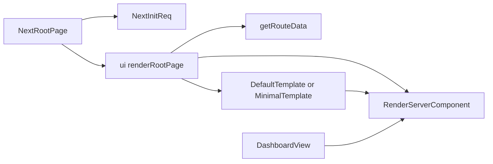
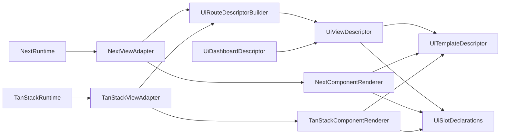

# UI Framework-Agnostic Views

## Goal

Move shared admin view logic toward a framework-agnostic layer in `@payloadcms/ui`, while moving Next-specific request, routing, and React Server Component behavior into `@payloadcms/next`.

This document supersedes the recent TanStack-specific client-shell direction from:

- `docs/plans/2026-04-02-tanstack-start-client-rendering.md`
- `docs/plans/2026-04-02-tanstack-start-client-rendering-plan.md`

Those documents assumed the right answer was to add a TanStack-only page shell beside the existing Next path. The better direction is to make the shared admin view layer portable first, then let each framework package provide its own runtime wrapper.

## Why The Previous Direction Is Wrong

The recent TanStack work correctly identified that the current `ui` admin rendering path is not safely consumable by an isomorphic route graph, but it pushed the fix too far into `packages/tanstack-start`.

That approach has two problems:

1. It duplicates admin view and template behavior in a second package instead of fixing the boundary in the shared layer.
2. It preserves the assumption that Next keeps the "real" admin path and other frameworks must adapt around it with client-only substitutes.

If `@payloadcms/ui` is truly the shared admin UI package, it should own the framework-agnostic view contracts and composition rules. `@payloadcms/next` should own the Next-specific runtime and RSC integration.

## Verified Current Boundary Problem

### Shared `ui` still owns framework-shaped rendering

`packages/ui/src/views/Root/RenderRoot.tsx` is described as framework-agnostic, but it still owns:

- route-to-view orchestration
- auth redirects
- template selection
- direct rendering of payload components through `RenderServerComponent`

`packages/ui/src/views/Dashboard/index.tsx` is also not just a shared dashboard view. It currently mixes:

- request-bound data fetches like `getGlobalData(req)`
- server props assembly
- `RenderServerComponent` invocation for dashboard component resolution

### `RenderServerComponent` is the hidden framework seam

`packages/ui/src/elements/RenderServerComponent/index.tsx` currently decides:

- how `PayloadComponent` values are resolved from the import map
- whether a resolved component is treated as an RSC-like server component
- when `serverProps` are merged into the render call

That is the main coupling point between:

- shared view and template description in `ui`
- framework-specific server rendering behavior

### `ui` still contains Next-specific assumptions

The clearest example is `packages/ui/src/elements/Link/index.tsx`, which imports `next/link.js` directly. That means `ui` still embeds a runtime-specific navigation primitive instead of consuming an adapter-provided one.

## Current Layering



Today, `packages/next` is mostly a wrapper around a rendering model that still lives in `ui`.

That is backward for a portable architecture.

## Target Architecture



In the target state:

- `@payloadcms/ui` defines route resolution, shared view descriptors, template contracts, slot declarations, and dashboard behavior.
- `@payloadcms/next` owns Next request initialization, `redirect` / `notFound`, server actions, `next/navigation`, document shell wiring, and RSC-aware component rendering.
- `@payloadcms/tanstack-start` consumes the same shared descriptors through its own runtime adapter instead of recreating view/template logic.

## Boundary Rules

### `@payloadcms/ui` should own

- route and view descriptors
- template and slot contracts
- shared dashboard view composition
- framework-neutral router interfaces and provider contracts
- framework-neutral component resolution interfaces

### `@payloadcms/next` should own

- `initReq` built on `next/headers`
- `redirect` / `notFound`
- server actions and cookie writes
- `next/navigation` router integration
- `next/link` integration
- RSC-aware payload component execution
- app-router document shell concerns

### `@payloadcms/tanstack-start` should own

- TanStack route loaders and server functions
- TanStack router integration
- TanStack-specific request/runtime adapters
- use of shared `ui` descriptors instead of placeholder templates or duplicate views

## Renderer Boundary Proposal

The current `RenderServerComponent` API is too concrete. It renders immediately and embeds framework behavior in the shared layer.

The first architectural step should be to replace "render now" with "describe what must be rendered."

### Proposed split

1. Keep import-map and payload-component concepts in `ui`, but stop coupling them directly to a framework rendering decision.
2. Introduce a renderer boundary that can be implemented by `next` first and by TanStack later.

### Proposed shared types

```ts
type ViewComponentSpec = {
  component?: PayloadComponent | React.ComponentType
  fallback?: React.ComponentType
  clientProps?: object
  serverProps?: object
}

type ViewSlotSpec = {
  key: string
  spec: ViewComponentSpec
}

type FrameworkViewRenderer = {
  renderComponent: (spec: ViewComponentSpec) => React.ReactNode
  renderSlots: (specs: ViewSlotSpec[]) => Record<string, React.ReactNode>
}
```

This is intentionally small.

The important shift is:

- `ui` produces `ViewComponentSpec` and `ViewSlotSpec`
- the framework adapter decides how to execute them

### What changes in `ui`

The following files should stop invoking rendering directly and instead produce shared declarations or consume an injected renderer:

- `packages/ui/src/elements/RenderServerComponent/index.tsx`
- `packages/ui/src/views/Root/RenderRoot.tsx`
- `packages/ui/src/templates/Default/index.tsx`
- `packages/ui/src/views/Dashboard/index.tsx`

### What changes in `next`

`packages/next` should own the first renderer implementation for the new boundary.

That implementation should preserve current behavior by continuing to:

- resolve payload components through the import map
- detect RSC/server component behavior where needed
- merge server props only in the Next runtime

## Root Refactor: Shared Descriptor + Framework Wrapper

The current `renderRootPage` path should be split in two layers.

### Shared `ui` layer

The `ui` layer should build a root-level descriptor from:

- `getRouteData`
- auth/public-route decisions
- visible entities
- client config
- template selection
- slot/component specifications

The output should be a structured description of what the page is, not an already-rendered tree.

### Framework wrapper layer

The framework package should provide:

- request initialization
- framework redirects and not-found behavior
- renderer implementation
- final page/tree assembly

For Next, this means `packages/next/src/views/Root/index.tsx` becomes a true adapter entrypoint instead of a thin passthrough to a monolithic `ui` renderer.

## Dashboard-First Migration Slice

The first implementation slice should prove the architecture with `Root` and `Dashboard`.

### Scope

Included:

- root descriptor boundary
- renderer abstraction
- dashboard view migration
- Next adapter ownership of RSC execution for this slice

Deferred:

- list rendering
- document rendering
- full template cleanup
- broader custom-view support

### Why Dashboard First

`Dashboard` is the best proving path because it exercises:

- route selection from `getRouteData`
- template composition
- visible-entity and nav-group behavior
- configurable payload components
- server-derived data without immediately requiring full list/document form-state complexity

### Dashboard target shape

`packages/ui/src/views/Dashboard/index.tsx` should stop being the place where request-bound data fetching and direct server-component rendering are fused together.

Instead, it should move toward:

1. shared dashboard descriptor or shared dashboard composition in `ui`
2. renderer-driven execution of dashboard component specs in the framework package
3. Next preserving current behavior through its adapter implementation

## Next-Specific Ownership To Expand

The following `next` files already sit near the correct boundary and should continue moving in that direction:

- `packages/next/src/layouts/Root/index.tsx`
- `packages/next/src/views/Root/index.tsx`
- `packages/next/src/adapter/RouterProvider.tsx`
- `packages/next/src/utilities/initReq.ts`

In addition, navigation primitives currently embedded in `ui` should move behind adapter-owned implementations, starting with:

- `packages/ui/src/elements/Link/index.tsx`

The long-term goal is that `ui` consumes only framework-neutral router context, while `next` and TanStack each provide their own `Link`, pathname, search-params, and router operations through adapter wiring.

## Deferred Follow-Up Phases

### Phase 2: List

Apply the same pattern to list rendering by separating:

- shared list descriptor and slot declarations in `ui`
- framework rendering and request/runtime behavior in the adapter package

Likely touchpoints:

- `packages/ui/src/views/List/RenderListView.tsx`
- `packages/ui/src/views/List/renderListViewSlots.tsx`

### Phase 3: Document

Apply the same pattern to document rendering by separating:

- shared document descriptor and composition rules in `ui`
- framework execution of document-level payload components and server data in the adapter package

Likely touchpoints:

- `packages/ui/src/views/Document/RenderDocument.tsx`
- `packages/ui/src/views/Document/renderDocumentSlots.tsx`

### Phase 4: Templates And Custom Views

After dashboard, list, and document boundaries are stable:

- revisit `DefaultTemplate` and `MinimalTemplate`
- move more slot rendering to descriptor-driven contracts
- define the supported boundary for custom admin views across frameworks

## Non-Goals For Phase 1

- Do not finish the full TanStack admin implementation in this slice.
- Do not redesign list or document rendering yet.
- Do not preserve the TanStack placeholder-shell direction just because it exists.
- Do not keep Next-only assumptions in `ui` when they can be moved behind an adapter boundary.

## Success Criteria

Phase 1 is successful when:

1. the root/dashboard architecture can be described without requiring a TanStack-only template workaround
2. `ui` owns shared route/view/template contracts rather than direct framework rendering decisions
3. `next` clearly owns RSC and request/runtime execution for the migrated slice
4. the follow-up work for list and document is clearly staged behind the same boundary model

## Recommended First Implementation Steps

1. introduce a renderer abstraction beside the current `RenderServerComponent`
2. refactor root rendering so `ui` builds a shared page descriptor
3. implement the first Next renderer/adapter for that descriptor
4. migrate `Dashboard` to the new boundary
5. only then resume TanStack work against the shared `ui` contracts
