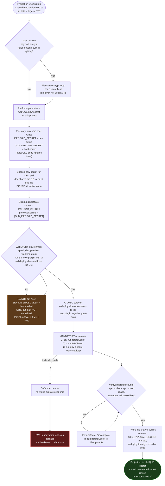

# PAYLOAD_SECRET Rotation — Fleet Rollout Plan

Date: 2026-08-10
Status: Draft for review
Companion docs: [design](./2026-08-05-payload-secret-rotation-design.md), [PRD](./2026-08-05-payload-secret-rotation-prd.md), and the shipped user guide [`docs/authentication/rotating-secret.mdx`](../authentication/rotating-secret.mdx)

## Purpose

The core Payload feature (versioned keyring, `previousSecrets`, `rotateSecret`, the
authenticated `v1:` envelope) is built. This document is the **platform rollout**: how
`@payloadcms/figma` migrates its hosted fleet — every project created under a single
platform-level **hard-coded secret** — onto a **unique per-project secret**, and then
retires the shared one.

## The exposure we are actually fixing

Today one hard-coded secret decrypts data across the entire fleet. Rotating isn't the goal;
**giving each project its own secret and retiring the shared one** is. A leak of the
shared secret currently compromises every project.

## The one constraint that shapes everything (assumption #6)

**All of a project's environments share one database.** Consequently a project's cutover
must be **atomic across every environment** — prod, dev, preview, branch deploys, workers,
cron. You can never have old-plugin code and new-plugin code writing the same DB under
different active secrets. This single rule is the source of every guard in the flowchart.

## Failure modes folded into the plan

| ID  | Trigger                                                                 | Behavior                                                                                                                                                                                                                                                                     | Loud or silent           | Guard in flow                                       |
| --- | ----------------------------------------------------------------------- | ---------------------------------------------------------------------------------------------------------------------------------------------------------------------------------------------------------------------------------------------------------------------------- | ------------------------ | --------------------------------------------------- |
| FM1 | Old code **reads** a migrated `v1` value                                | Old `decrypt` feeds a non-hex IV to `aes-256-ctr` → **throws** "Invalid IV length"                                                                                                                                                                                           | Loud (availability)      | Atomic cutover — no old code on the DB post-cutover |
| FM2 | Old code **writes** an encrypted field after cutover                    | Writes a legacy CTR value under the stale hard-coded key; new code's legacy read path uses only the **active** key (never trials the keyring, `crypto.ts:133–138`) → silent garbage → re-save persists it                                                                    | **Silent (corruption)**  | No partial cutover; block old deploys from the DB   |
| FM3 | New code reads pre-existing legacy data **before** the re-key migration | All fleet data is legacy CTR under the (now previous) hard-coded secret; normal read path uses the active key → garbage until `rotateSecret`/`reencrypt` upgrades each row. Built-in API keys survive (keyring-aware HMAC index); **custom `payload.encrypt` fields do not** | Silent for custom fields | Migration is **mandatory at cutover**, not deferred |
| FM4 | JWT skew across versions                                                | Tokens signed under a key the reader lacks fail to verify → affected users re-login                                                                                                                                                                                          | Loud, self-healing       | None needed                                         |

Why `previousSecrets` does **not** rescue FM2/FM3 for legacy data: the legacy CTR path is
unauthenticated and intentionally does not trial the keyring, so a pre-`v1` value is only
readable while the **active** secret is the one that wrote it. That is why assumptions
**#7–#8 ("migrate over time as data is re-written")** are unsafe for legacy data — natural
re-writes under version skew _are_ FM2.

## Rollout flowchart

## Answers to the open questions

**Can the platform write secrets?** Yes — full control, so this is a **push** model. Two
things are safe to do fleet-wide with zero risk because old code ignores them: (1) generate
a unique secret per project, and (2) pre-stage `PAYLOAD_SECRET` (new) and
`OLD_PAYLOAD_SECRET` (hard-coded) as env vars. Risk begins only at the plugin upgrade + the
first write under the new secret — hence the atomic-cutover guard.

**How do devs get a matching dev secret?** Because dev shares the production DB, dev **must**
use the identical active secret — a dev-generated or mismatched secret writes foreign-key
data straight into FM2. Best case: the platform exposes the per-project secret via a
dashboard reveal or a CLI pull (à la `vercel env pull`) so developers pull
`PAYLOAD_SECRET` + `OLD_PAYLOAD_SECRET` rather than inventing them. Never let a developer set
their own.

**How do we retire the old secret?** After the migration verifies clean, the platform removes
the `OLD_PAYLOAD_SECRET` env var and redeploys. `previousSecrets` is read **once at config
load**, so retirement requires a restart/redeploy — which the platform controls. Recommend
distributing the old secret as a **per-project env var, not baked into plugin source**
(revising assumption #4): a source-baked shared secret can't be retired per project and
lives in version control. Optional belt-and-suspenders: date-gate the previous secret in the
plugin (the `OLD_PAYLOAD_SECRET_EXPIRATION` pattern in the user guide) so it drops out on the
next boot even if the env var lingers.

## Remaining gaps to resolve

- **Enumerate _all_ compute that touches each DB.** "Prod + dev" is not enough — preview
  deploys, branch deploys, background workers, and cron on old code are each an FM2 vector.
  The atomic-cutover guard is only as good as this inventory.
- **Detect custom `payload.encrypt` usage across the fleet.** Built-in API keys are handled
  by `rotateSecret`; custom encrypted fields need a bespoke `reencrypt` loop and are the
  FM3 casualty if missed. Needs a static scan of hosted configs.
- **Cutover is one-way.** Once new-secret `v1` data is written, rolling back to the old
  plugin hits FM1/FM2. Rollback means restoring the DB or re-keying back — state this in the
  runbook.
- **Migration cost at scale.** Large collections need batching (`batchSize`) and a plan for
  lock/duration; decide whether it runs inline at deploy or as a tracked job.
- **Negligible-risk projects (assumption #2).** Can be deprioritized, but note they still
  incur the FM4 re-login blip if/when cut over; decide whether they get unique secrets at all.
- **Dev-secret handling.** A pulled production-equivalent secret is now on developer laptops —
  decide on short-lived pulls / rotation cadence so this doesn't become a new leak surface.
