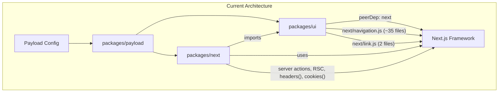
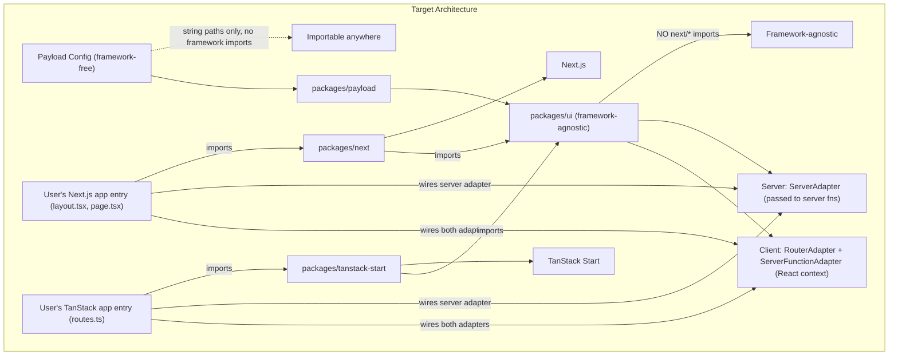

# Decoupling Payload Admin Panel from Next.js: Framework Adapter Pattern

## Current Architecture Summary

Today, Payload's admin panel is tightly coupled to Next.js through several mechanisms:

- **`packages/ui`** has `next` as a `peerDependency` and imports `next/navigation.js` (~35 files), `next/link.js` (2 files), and `next/dist/*` types (3 files)
- **`packages/next`** is a monolithic package mixing Next.js plumbing (layouts, routes, `initReq`, server actions, `withPayload`) with admin UI orchestration (views, templates, elements, route resolution)
- **Server functions** (`handleServerFunctions`) are invoked via Next.js server actions (`'use server'` directive) -- a framework-specific RPC mechanism
- **`RenderServerComponent`** in `packages/ui` relies on `isReactServerComponentOrFunction` which inspects `$$typeof` for `Symbol.for('react.client.reference')` -- an RSC-specific runtime behavior
- **`packages/payload/src/config/types.ts`** imports `Metadata` from `next` directly (line 13)
- The `@payloadcms/ui/rsc` entrypoint exports async server components and server-only utilities that only work in RSC environments
- Several server function handlers (`render-document`, `render-list`) return **React nodes** (RSC-serialized JSX), which fundamentally requires RSC flight protocol support



## Key Constraint: Payload Config Must Remain Framework-Free

The Payload config (`payload.config.ts`) **must not import framework-specific code**. This is the core reason Payload uses string paths for custom components -- so the config can be imported anywhere (API routes, scripts, workers, non-Next.js frameworks). The framework adapter **cannot** live in the Payload config like `db: mongooseAdapter(...)` does, because importing a framework adapter would pull in framework-specific modules and break the config's portability.

Instead, the adapter is wired at the **framework integration layer** -- the user's app entry files (e.g., `layout.tsx` + `page.tsx` for Next.js, or route definitions for TanStack Start). This is exactly how the current Next.js integration works: the user's layout imports from `@payloadcms/next/layouts` and passes `config`, `importMap`, and `serverFunction` to `RootLayout`. The Payload config itself has no awareness of which framework is running.

## Target Architecture



---

## Phase 1: Define the Framework Adapter Contract

**Complexity: HIGH** -- This is the foundational design decision. Every subsequent phase depends on getting this right.

### 1.1 Define adapter contracts as types/interfaces in `packages/payload`

Unlike database adapters which live in the config, framework adapters are wired at the **app entry level** (user's layout/routes). However, the **type contracts** still belong in `packages/payload` so that both the adapter packages and `packages/ui` can depend on them without circular dependencies.

Define in [`packages/payload/src/admin/`](packages/payload/src/admin/):

The adapter has two sides: **client-side** (React context providers for browser code) and **server-side** (passed into server functions for things like reading cookies or triggering redirects).

#### Client-side adapter (provided via React context)

**`RouterAdapter`**:

- `useRouter(): { push, replace, back, refresh }` -- programmatic navigation hook
- `usePathname(): string` -- current pathname hook
- `useSearchParams(): URLSearchParams` -- search params hook
- `useParams(): Record<string, string | string[]>` -- route params hook
- `Link: React.ComponentType<{ href: string; prefetch?: boolean; replace?: boolean; children: React.ReactNode }>` -- link component

**`ServerFunctionAdapter`** (transport layer):

- Already exists as `ServerFunctionClient` type. The adapter provides the implementation: Next.js uses `'use server'` + `handleServerFunctions`; other frameworks use REST/HTTP calls to a server endpoint.

**`ComponentRenderer`** (how custom PayloadComponents are resolved and rendered):

- `renderComponent(args): React.ReactNode | null` -- resolves a `PayloadComponent` from the import map and renders it. In RSC-capable frameworks, this is the current `RenderServerComponent` with server/client prop splitting. In non-RSC frameworks, all components are client components (no serverProps).

#### Server-side adapter (passed into server functions, NOT React context)

Currently, server-side code in `packages/next` directly calls Next.js APIs like `cookies()`, `headers()`, `redirect()`, and `notFound()`. If shared server logic (route resolution, view data loading, auth checks) moves into `packages/ui`, it can no longer import these directly.

**`ServerAdapter`** -- an object passed into server-side functions that abstracts framework-specific server APIs:

- `getCookies(): CookieStore` -- read request cookies. Next.js: `cookies()` from `next/headers`. TanStack Start: from the Vinxi request context.
- `getHeaders(): Headers` -- read request headers. Next.js: `headers()` from `next/headers`. TanStack Start: from the request object.
- `redirect(path: string): never` -- trigger a server-side redirect. Next.js: `redirect()` from `next/navigation`. TanStack Start: `throw redirect()`.
- `notFound(): never` -- trigger a 404 response. Next.js: `notFound()` from `next/navigation`. TanStack Start: `throw notFound()` or equivalent.
- `setCookie(name: string, value: string, options?: CookieOptions): void` -- write a cookie (e.g., language preference). Next.js: `cookies().set(...)`. TanStack Start: via response headers.

The `ServerAdapter` is **not** provided via React context (it runs on the server, not in the browser). Instead, it is passed as an argument to shared server functions. For example:

```typescript
// packages/ui (shared, framework-agnostic)
export function resolveAdminRoute({ serverAdapter, config, segments, req }) {
  // ... route resolution logic ...
  if (!permissions.canAccessAdmin) {
    serverAdapter.redirect(handleAuthRedirect({ config, route }))
  }
  if (!collectionConfig) {
    serverAdapter.notFound()
  }
}
```

```typescript
// packages/next (Next.js adapter provides its implementation)
import { cookies, headers } from 'next/headers'
import { redirect, notFound } from 'next/navigation'

export const nextServerAdapter: ServerAdapter = {
  getCookies: () => cookies(),
  getHeaders: () => headers(),
  redirect: (path) => redirect(path),
  notFound: () => notFound(),
  setCookie: async (name, value, options) => {
    const c = await cookies()
    c.set({ name, value, ...options })
  },
}
```

```typescript
// packages/tanstack-start (TanStack adapter provides its implementation)
import { getWebRequest } from 'vinxi/http'

export const tanstackServerAdapter: ServerAdapter = {
  getCookies: () => parseCookies(getWebRequest().headers),
  getHeaders: () => getWebRequest().headers,
  redirect: (path) => {
    throw redirect({ to: path })
  },
  notFound: () => {
    throw notFound()
  },
  setCookie: (name, value, options) => setCookie(name, value, options),
}
```

This pattern allows `initReq`, route resolution in `RootPage`, language switching, and auth redirects to be shared across adapters without importing any framework module directly.

### 1.2 Adapter wiring happens at the app entry, NOT in the Payload config

The Payload config stays framework-free. Instead, the adapter is wired in the user's app entry:

```typescript
// Next.js: app/(payload)/layout.tsx (current pattern, unchanged)
import { RootLayout } from '@payloadcms/next/layouts'
import { handleServerFunctions } from '@payloadcms/next/layouts'
import config from '@payload-config'
import { importMap } from './importMap.js'

const serverFunction = async function (args) {
  'use server'
  return handleServerFunctions({ ...args, config, importMap })
}

export default function Layout({ children }) {
  return <RootLayout config={config} importMap={importMap} serverFunction={serverFunction}>{children}</RootLayout>
}
```

```typescript
// TanStack Start: app/routes/admin.tsx (new pattern)
import { createPayloadAdmin } from '@payloadcms/tanstack-start'
import config from '@payload-config'
import { importMap } from './importMap.js'

export const Route = createPayloadAdmin({ config, importMap })
```

Each adapter package provides its own entry-point functions (`RootLayout`, `RootPage`, `createPayloadAdmin`, etc.) that internally wire the `RouterAdapter`, `ServerFunctionAdapter`, `ServerAdapter`, and `ComponentRenderer` into the UI's context providers and server functions.

### 1.3 Define server function REST endpoint contract

For frameworks that lack server actions, define a standard REST endpoint contract:

- `POST /api/payload-admin-fn` accepting `{ name: string, args: object }`
- The adapter's `createServerFunction()` returns a client-side function that POSTs to this endpoint
- The endpoint calls the same handler registry (`handleServerFunctions` logic, moved to a shared location)

**Critical consideration:** Several server functions (`render-document`, `render-list`, `render-widget`) currently return **React nodes** (RSC flight payloads). For non-RSC frameworks, these must be redesigned to return **serializable data** instead, with the client rendering the components from that data. This is the single largest architectural change.

---

## Phase 2: Make `packages/ui` Framework-Agnostic

**Complexity: HIGH** -- 35+ files need changes; must maintain backward compatibility for Next.js users.

### 2.1 Remove all `next/*` imports from `packages/ui`

Currently affected (grouped by what they import):

**`next/navigation.js`** (~35 files) importing `useRouter`, `useSearchParams`, `usePathname`, `useParams`:

- All providers: `Auth`, `ListQuery`, `Folders`, `Locale`, `Selection`, `Translation`, `RouteCache`, `SearchParams`, `Params`
- All views: `List`, `Edit`, `CollectionFolder`, `BrowseByFolder`
- `forms/Form/index.tsx`
- ~20 elements: `Link`, `Nav/context`, `SortComplex`, `DeleteDocument`, `DuplicateDocument`, `RestoreButton`, `LeaveWithoutSaving`, `EditMany`, `DeleteMany`, `PublishMany`, `UnpublishMany`, etc.

**`next/link.js`** (2 files):

- [`packages/ui/src/elements/Link/index.tsx`](packages/ui/src/elements/Link/index.tsx) -- imports Next `Link` component
- [`packages/ui/src/elements/Popup/PopupButtonList/index.tsx`](packages/ui/src/elements/Popup/PopupButtonList/index.tsx) -- imports `LinkProps` type

**`next/dist/*`** (3 files):

- [`packages/ui/src/utilities/handleGoBack.tsx`](packages/ui/src/utilities/handleGoBack.tsx) -- `AppRouterInstance` type
- [`packages/ui/src/utilities/handleBackToDashboard.tsx`](packages/ui/src/utilities/handleBackToDashboard.tsx) -- `AppRouterInstance` type
- [`packages/ui/src/utilities/getRequestLanguage.ts`](packages/ui/src/utilities/getRequestLanguage.ts) -- `ReadonlyRequestCookies` type

### 2.2 Create a `RouterAdapter` provider in `packages/ui`

Create a `RouterAdapterProvider` that the framework adapter populates:

```typescript
// packages/ui/src/providers/RouterAdapter/index.tsx
type RouterAdapter = {
  Link: React.ComponentType<LinkProps>
  useParams: () => Record<string, string | string[]>
  usePathname: () => string
  useRouter: () => {
    back: () => void
    push: (path: string) => void
    refresh: () => void
    replace: (path: string) => void
  }
  useSearchParams: () => URLSearchParams
}
```

All 35+ files currently importing from `next/navigation.js` would instead import from this provider. The provider is populated by the framework adapter in the layout.

### 2.3 Remove `next` from `peerDependencies`

Remove `next` from [`packages/ui/package.json:181`](packages/ui/package.json). After Phase 2.1 is complete, the UI package should have zero Next.js imports.

### 2.4 Restructure `@payloadcms/ui/rsc` entrypoint

The [`packages/ui/src/exports/rsc/index.ts`](packages/ui/src/exports/rsc/index.ts) entrypoint currently exports async server components (`CollectionCards`, `FolderTableCell`, `FolderField`) and server-only handlers (`_internal_renderFieldHandler`, `copyDataFromLocaleHandler`).

- **Server-only handlers** (pure data logic, no JSX): keep in `@payloadcms/ui` but move to a `/server` entrypoint (not RSC-specific)
- **Async server components** (RSC-specific): move to `packages/next` or gate behind adapter capability detection
- **`RenderServerComponent`**: refactor to be pluggable. The current implementation in [`packages/ui/src/elements/RenderServerComponent/index.tsx`](packages/ui/src/elements/RenderServerComponent/index.tsx) checks `isReactServerComponentOrFunction` which relies on `$$typeof === Symbol.for('react.client.reference')` -- this only works in RSC bundler environments. The adapter must supply the rendering bridge.

---

## Phase 3: Restructure `packages/next` as a Pure Adapter

**Complexity: HIGH** -- Large package with many interleaved concerns.

### 3.1 Extract framework-agnostic view/route logic

[`packages/next/src/views/Root/getRouteData.ts`](packages/next/src/views/Root/getRouteData.ts) (484 lines) contains **pure Payload routing logic** (segment matching, view resolution, collection/global lookup) but lives in the Next.js package. This and related files should move:

**Move to `packages/ui`** (framework-agnostic, reusable by any adapter):

- `getRouteData.ts` -- route/segment to view mapping (pure logic, no framework imports)
- `getCustomViewByRoute.ts`, `getCustomViewByKey.ts`, `getDocumentViewInfo.ts`, `isPathMatchingRoute.ts`, `attachViewActions.ts` -- all pure config lookup
- `handleAuthRedirect.ts`, `isPublicAdminRoute.ts`, `isCustomAdminView.ts` -- auth/route utilities

These belong in `packages/ui` rather than `packages/payload` because they are admin panel routing concerns, not core CMS logic. Any framework adapter needs to resolve URL segments to admin views, so this logic must live in the shared UI package where all adapters can import it.

**Keep in `packages/next`** (Next.js specific):

- `initReq.ts` -- uses `next/headers`
- `RootPage` (the async server component orchestrator)
- `RootLayout` -- uses `next/headers`, `cookies()`, `Suspense` cache pattern
- `withPayload.js` -- Next.js webpack/turbopack config
- `routes/rest/`, `routes/graphql/` -- Next.js Route Handler wrappers
- `auth/login.ts`, `logout.ts`, `refresh.ts` -- `'use server'` files
- View implementations that use `notFound()`, `redirect()` from `next/navigation`

### 3.2 Move UI elements from `packages/next` to `packages/ui`

Several components in `packages/next/src/elements/` and `packages/next/src/templates/` are **admin UI** with minor Next.js ties:

- `templates/Default/`, `templates/Minimal/` -- layout chrome (mostly CSS + composition). Move to `packages/ui`, replacing any `next/navigation` imports with the `RouterAdapter`
- `elements/Nav/`, `elements/DocumentHeader/`, `elements/Logo/`, `elements/FormHeader/` -- admin elements. Move to `packages/ui`

### 3.3 Move view implementations that are reusable

Many views in `packages/next/src/views/` (Dashboard, Document, List, Login, Account, etc.) contain a mix of:

- Data fetching (framework-specific, uses `initReq`)
- UI rendering (framework-agnostic, uses `@payloadcms/ui` components)

Split each into:

- **Data loader** (stays in adapter or becomes a shared utility if it only uses `PayloadRequest`)
- **View component** (moves to `packages/ui` if it's pure client rendering)

### 3.4 Restructure `handleServerFunctions`

[`packages/next/src/utilities/handleServerFunctions.ts`](packages/next/src/utilities/handleServerFunctions.ts) is the server function dispatcher. Its core logic (name-to-handler mapping) is framework-agnostic but `initReq` call is Next-specific.

- Move the handler **registry** and **dispatch logic** to `packages/payload` (or a shared location)
- Each adapter provides its own `initReq` (using its `ServerAdapter`) and wires the dispatch to its transport (server actions for Next.js, REST endpoint for others)
- Handlers from `@payloadcms/ui/rsc` that return **React nodes** (`render-document`, `render-list`, `render-widget`, `render-field`) need a non-RSC alternative path that returns serializable data

---

## Phase 4: Handle the RSC-Specific Rendering Problem

**Complexity: VERY HIGH** -- This is the deepest architectural challenge.

### 4.1 The "React Nodes Over the Wire" Problem

Currently, several server functions return `React.ReactNode` (RSC flight payloads):

- `render-document` -- returns `{ Document: React.ReactNode, data, preferences }`
- `render-list` -- returns `{ List: React.ReactNode, preferences }`
- `render-widget` -- returns rendered dashboard widgets
- `render-field` -- returns rendered field components
- `render-document-slots` -- returns `DocumentSlots`

This works because Next.js's server action transport serializes React elements via the RSC flight protocol. **Non-RSC frameworks cannot do this.**

### 4.2 Strategy: Data-First Rendering

For non-RSC adapters, these server functions must return **data only**, and the client renders the components:

- `render-document` -> returns `{ data, preferences, viewConfig }` (no JSX); client-side renders `<DocumentView data={data} ... />`
- `render-list` -> returns `{ docs, totalDocs, columns, preferences }` (no JSX); client-side renders `<ListView ... />`

This means the current views need to be decomposed into:

1. **Data fetchers** (server-side, return JSON) -- shared across all adapters
2. **View renderers** (client-side, consume data and render JSX) -- live in `packages/ui`

The Next.js adapter can optimize by keeping the RSC path (returning pre-rendered nodes), while non-RSC adapters use the data-first path.

### 4.3 RenderServerComponent Replacement

[`RenderServerComponent`](packages/ui/src/elements/RenderServerComponent/index.tsx) currently:

1. Resolves components from the import map
2. Detects RSC via `$$typeof` check
3. Passes `serverProps` only to RSC components

For non-RSC frameworks:

- Step 1 remains the same (import map resolution is framework-agnostic)
- Step 2: all components are treated as client components (no `$$typeof` check)
- Step 3: `serverProps` are never passed directly; they must be fetched via the data-first API

The adapter provides its own `renderComponent` implementation.

---

## Phase 5: Import Map Generation

**Complexity: MEDIUM** -- The mechanism is mostly framework-agnostic, but file output is Next.js-coupled.

### 5.1 Abstract import map file generation

[`generateImportMap`](packages/payload/src/bin/generateImportMap/index.ts) currently assumes Next.js app directory structure for output (`app/(payload)/admin/importMap.js`). The adapter must specify:

- Output file path
- Module format (ESM, CJS)
- Any framework-specific wrapper needed

### 5.2 Import map at runtime

The import map object structure itself is framework-agnostic. The adapter is responsible for:

- Generating/bundling the import map file in the correct location for the framework
- Passing the resolved `importMap` object to the UI at boot time

---

## Phase 6: Remove `next` Types from `packages/payload`

**Complexity: LOW**

- Replace `import type { Metadata } from 'next'` in [`packages/payload/src/config/types.ts:13`](packages/payload/src/config/types.ts) with a Payload-owned `AdminMeta` type that is a subset/equivalent
- The Next.js adapter maps `AdminMeta` -> `Metadata` from `next`

---

## Phase 7: Create Reference Non-Next Adapter (TanStack Start)

**Complexity: HIGH** -- Proves the abstraction works end-to-end.

### 7.1 `packages/tanstack-start` adapter

Implements `FrameworkAdapter` using:

- TanStack Router for navigation (`useRouter`, `Link`, etc.)
- Standard `fetch` to a REST endpoint for server functions (no server actions)
- SSR without RSC (data-first rendering for all views)
- TanStack's file-based routing or programmatic route config for admin routes
- A `ServerAdapter` implementation using Vinxi's request context for cookies/headers and TanStack's `redirect()`/`notFound()` primitives

### 7.2 Validate with test suite

Run existing admin integration tests against the TanStack adapter to verify feature parity.

---

## Risk Assessment and Open Questions

1. **RSC flight payloads** -- The biggest risk. Server functions returning React nodes is deeply coupled to RSC. The data-first alternative requires decomposing every view into data+component layers. Estimate: this alone is 40-50% of total effort.
2. **Custom components (`PayloadComponent` string paths)** -- The import map mechanism is sound and framework-agnostic. But the `serverProps` concept (props only passed on the server to RSC components) has no equivalent in non-RSC frameworks. These props would need to be fetched as data instead.
3. **Payload config must stay framework-free** -- The config cannot import adapter packages. Adapter wiring must remain at the framework integration layer (user's app entry files). This is already the pattern used today with Next.js and must be preserved. The adapter contract types live in `packages/payload`, but the adapter implementations are never imported by the config.
4. **Server actions are framework-specific** -- Frameworks without server actions need an alternative transport for server functions. A REST endpoint that dispatches to the same handler registry is the natural fallback, but serialization constraints (no React nodes over REST) force the data-first rendering approach.
5. **Backward compatibility** -- `@payloadcms/ui` and `@payloadcms/next` are public APIs. Some breaking changes are acceptable here (this is a major architectural shift). Where possible, provide a deprecation period with re-exports from old paths, but breaking changes that are necessary for clean adapter boundaries should not be avoided -- they can ship as part of a major version.
6. **Performance** -- RSC provides zero-JS overhead for server-rendered parts. Non-RSC adapters will ship more JavaScript to the client. This is an accepted trade-off.
7. **`packages/payload` dependency on `next` types** -- Currently only `Metadata` type (line 13 of config/types.ts). Low risk to replace.

---

## Complexity Summary

| Phase | Description                                 | Complexity |
| ----- | ------------------------------------------- | ---------- |
| 1     | Define Framework Adapter Contract           | HIGH       |
| 2     | Make `packages/ui` framework-agnostic       | HIGH       |
| 3     | Restructure `packages/next` as pure adapter | HIGH       |
| 4     | Handle RSC rendering problem (data-first)   | VERY HIGH  |
| 5     | Abstract import map generation              | MEDIUM     |
| 6     | Remove `next` types from `packages/payload` | LOW        |
| 7     | Reference TanStack Start adapter            | HIGH       |

Phases 1-3 can partially overlap. Phase 4 is the critical path. Phase 6 can be done independently at any time. Phase 7 depends on all prior phases.
