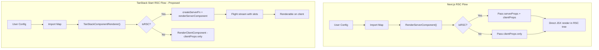

# TanStack Start RSC Support for Payload Custom Components

## Background

TanStack Start recently shipped experimental RSC support (April 2026). Their model differs fundamentally from Next.js:

- **Next.js**: Server-first tree. Components are server components by default; `'use client'` marks interactive boundaries. The framework owns the component tree.
- **TanStack Start**: Client-first tree. RSCs are "just data" -- Flight streams fetched via `createServerFn`, decoded on the client, and rendered wherever the client decides. Uses `@vitejs/plugin-rsc` + Vite 7.

### TanStack Start RSC API Surface

From `@tanstack/react-start/rsc`:

- `renderServerComponent(<JSX />)` -- renders to a Flight stream, returns a renderable value (no slots)
- `createCompositeComponent((props) => <JSX />)` -- returns a composite source with slot support (children, render props, component props)
- `CompositeComponent` -- client component that renders a composite source and fills slots

Low-level Flight stream APIs (advanced use cases):

- `renderToReadableStream` -- renders React elements to a Flight stream on the server
- `createFromReadableStream` -- decodes a Flight stream on the client or during SSR
- `createFromFetch` -- decodes directly from a fetch response

Reference: https://tanstack.com/blog/react-server-components

### Current State in Payload

The TanStack adapter currently **disables RSC entirely**:

- `packages/tanstack-start/src/vite/plugin.ts`: sets `PAYLOAD_FRAMEWORK_RSC_ENABLED = 'false'`
- `packages/tanstack-start/src/elements/RenderComponent/index.tsx`: `TanStackComponentRenderer` delegates to `RenderClientComponent`, which drops all `serverProps`
- All custom components are treated as client components -- `serverProps` (payload instance, i18n, locale, permissions, user, etc.) are never passed
- **~50+ e2e tests** are skipped via `{ framework: 'rsc' }` in the test helper (`test/__helpers/e2e/playwright.ts`)
- Test configs conditionally exclude RSC components via `isRSCEnabled()` checks

## Key Architecture Differences to Bridge



### Critical Differences

| Concern                    | Next.js                              | TanStack Start                                                                                                       |
| -------------------------- | ------------------------------------ | -------------------------------------------------------------------------------------------------------------------- |
| Server component rendering | Direct JSX in RSC tree               | Must go through `createServerFn` + `renderServerComponent` / `createCompositeComponent`                              |
| Props passing              | `serverProps` passed directly to RSC | Server props are available inside the server function scope; client slots receive serializable data via render props |
| Component tree ownership   | Server owns tree                     | Client owns tree, server provides "data" (Flight streams)                                                            |
| Build tooling              | Next.js compiler handles RSC         | `@vitejs/plugin-rsc` + Vite 7 required                                                                               |
| `'use client'` boundary    | Standard React convention            | Supported, but `createServerFn` is the primary server boundary                                                       |

### How Next.js Adapter Handles RSC Today

1. **`RenderServerComponent`** (`packages/next/src/elements/RenderServerComponent/index.tsx`): Resolves `PayloadComponent` via `getFromImportMap`, checks `isReactServerComponentOrFunction` (via `$$typeof !== Symbol.for('react.client.reference')`), merges `serverProps` for server components
2. **`NestProviders`** (`packages/next/src/layouts/Root/NestProviders.tsx`): Recursively wraps `config.admin.components.providers` with `RenderServerComponent`, passing `serverProps`
3. **`handleServerFunctions`** (`packages/next/src/utilities/handleServerFunctions.ts`): Uses `mode: 'rsc'` and passes `RenderServerComponent` as `renderComponent`
4. **Field rendering**: `renderField` in UI receives `renderComponent` callback; server components get `serverProps` (payload, i18n, form state, etc.)

### How TanStack Adapter Handles Components Today

1. **`TanStackComponentRenderer`** (`packages/tanstack-start/src/elements/RenderComponent/index.tsx`): Delegates to `RenderClientComponent` -- never passes `serverProps`
2. **`getAdminPageData`** (`packages/tanstack-start/src/views/Root/index.tsx`): Passes `renderComponent: RenderClientComponent` everywhere
3. **`handleServerFunctions`** (`packages/tanstack-start/src/utilities/handleServerFunctions.ts`): Uses `mode: 'data-only'`, `renderComponent: RenderClientComponent`
4. **Two import maps**: `importMap.server.ts` (empty, for server loaders) and `importMap.js` (client, for `AdminView`)

## Implementation Plan

### Phase 1: Vite RSC Infrastructure

**Files to modify:**

- `packages/tanstack-start/src/vite/plugin.ts`

Changes:

- Add optional `rsc` config option to `PayloadPluginOptions` (e.g. `rsc?: { enabled: boolean }`)
- When `rsc.enabled`, set `PAYLOAD_FRAMEWORK_RSC_ENABLED = 'true'` instead of `'false'`
- Pass `rsc: { enabled: true }` to the `tanstackStart()` plugin call
- Require consumer to also add `@vitejs/plugin-rsc` (document this, or auto-detect)
- Keep backward-compatible: RSC off by default

### Phase 2: Server Component Renderer

**New/modified files:**

- `packages/tanstack-start/src/elements/RenderComponent/index.tsx` -- the core renderer

The challenge: In Next.js, `RenderServerComponent` can directly render `<Component {...serverProps} {...clientProps} />` in the RSC tree. In TanStack Start, server components must be rendered inside a `createServerFn` handler using `renderServerComponent()` or `createCompositeComponent()`.

**Approach: Pre-render on server, pass as data**

For custom components that are server components (detected via `isReactServerComponentOrFunction`):

1. During the server-side data fetching phase (in `getAdminPageData` at `packages/tanstack-start/src/views/Root/index.tsx`), render RSC components via `renderServerComponent()`
2. Return the rendered output as part of the serialized page data
3. On the client, render the pre-rendered RSC output as a renderable value

The key insight: Payload's `serverProps` (payload, i18n, locale, etc.) are already available inside `getAdminPageData`. We need to:

- Identify which custom components are RSCs (by checking the import map)
- Pre-render them on the server using `renderServerComponent()`
- Pass the rendered output as serializable data to the client
- The client renders the pre-rendered RSC output instead of trying to render the component directly

**Simpler approach for most components:**

```typescript
// Server-side (in getAdminPageData or a createServerFn):
import { renderServerComponent } from '@tanstack/react-start/rsc'

const renderedRSC = await renderServerComponent(
  <UserComponent {...serverProps} {...clientProps} />
)
// Pass renderedRSC to client as data

// Client-side:
// Simply render {renderedRSC} in the component tree
```

This is conceptually simpler than composite components since most Payload custom server components don't need slots -- they receive props and return JSX.

**For interactive RSCs (slots needed):**

```typescript
// Server-side:
import { createCompositeComponent } from '@tanstack/react-start/rsc'

const src = await createCompositeComponent(
  (props: { children?: React.ReactNode }) => (
    <ServerRenderedWrapper>
      <h1>{serverData.title}</h1>
      {props.children}
    </ServerRenderedWrapper>
  ),
)

// Client-side:
import { CompositeComponent } from '@tanstack/react-start/rsc'

<CompositeComponent src={src}>
  <InteractiveClientChild />
</CompositeComponent>
```

### Phase 3: Two-Pass Rendering Strategy

The practical problem: `ComponentRenderer` is called synchronously during JSX rendering. TanStack Start's RSC APIs are async. We need a two-pass approach:

**Pass 1 (Server - in `getAdminPageData`):**

- Walk the page data to find all `PayloadComponent` references that resolve to server components
- Pre-render each one via `renderServerComponent()`
- Store the rendered outputs in a map keyed by component path + props hash
- Include the pre-rendered map in the serialized page data sent to the client

**Pass 2 (Client - in `AdminView`):**

- The `TanStackComponentRenderer` checks the pre-rendered map
- If a pre-rendered result exists, returns it directly
- Otherwise, falls back to `RenderClientComponent`

**Key files to modify:**

- `packages/tanstack-start/src/views/Root/index.tsx` -- add pre-rendering pass in `getAdminPageData`
- `packages/tanstack-start/src/views/AdminView.tsx` -- consume pre-rendered components, provide via context
- `packages/tanstack-start/src/elements/RenderComponent/index.tsx` -- look up pre-rendered outputs

### Phase 4: Server Function for Dynamic RSC Rendering

For components rendered after initial page load (e.g. form state updates, drawer opens), create a dedicated `createServerFn`:

**New file:** `packages/tanstack-start/src/rsc/renderPayloadComponent.ts`

```typescript
import { createServerFn } from '@tanstack/react-start'
import { renderServerComponent } from '@tanstack/react-start/rsc'

export const renderPayloadRSC = createServerFn().handler(async ({ data }) => {
  const { componentPath, props, importMap } = data
  const Component = getFromImportMap({ importMap, PayloadComponent: componentPath })

  if (!Component) return null

  return renderServerComponent(<Component {...props} />)
})
```

Update `handleServerFunctions.ts` to use `mode: 'rsc'` and the RSC-aware renderer when RSC is enabled.

### Phase 5: Import Map and Build Integration

- The generated import map at `src/payload-import-map.ts` needs to be accessible from both server functions and client code
- Server components in the import map need to be importable in the RSC environment (Vite RSC plugin handles this via module graph separation)
- May need to split the import map into server and client portions:
  - `importMap.js` -- client components (existing)
  - `importMap.server.ts` -- currently empty, needs to be populated with server component imports
- The Vite RSC plugin (`@vitejs/plugin-rsc`) handles the `'use client'` / server boundary at the module level

### Phase 6: Test Config Updates

**Files to modify:**

- `test/__helpers/e2e/playwright.ts` -- update `isRSCEnabled` logic to support TanStack RSC mode
- `tanstack-app/vite.config.ts` -- add `@vitejs/plugin-rsc` and enable RSC in payloadPlugin options
- All test configs using `isRSCEnabled()` guards should work automatically once `PAYLOAD_FRAMEWORK_RSC_ENABLED` is `'true'`

**Test configs that conditionally include RSC components** (these will automatically include them when RSC is enabled):

- `test/admin/config.ts` -- providers, views, collections
- `test/admin/collections/Posts.ts` -- beforeListTable, beforeDocumentControls, Cell, Field
- `test/admin/collections/CustomViews1.ts`, `CustomViews2.ts` -- custom views
- `test/admin/collections/CustomFields/index.ts` -- custom server fields
- `test/admin/globals/Global.ts`, `CustomViews1.ts`, `CustomViews2.ts` -- global custom views
- `test/fields/collections/Select/index.ts`, `Radio/index.ts` -- JSX label options
- `test/fields/collections/ConditionalLogic/index.ts` -- custom server field
- `test/fields/collections/Tabs/index.ts` -- UI field in tabs
- `test/lexical/collections/Lexical/index.ts` -- BlockRSC
- `test/uploads/collections/AdminUploadControl/index.ts`, `CustomUploadField/index.ts` -- upload RSC components

## Skipped E2E Tests (to be enabled)

### Tests using `{ framework: 'rsc' }` (~50+ tests)

These are automatically skipped when `isRSCEnabled` is false (TanStack default):

**Admin tests:**

- `test/admin/e2e/general/e2e.spec.ts` -- custom provider server components
- `test/admin/e2e/list-view/e2e.spec.ts` -- beforeList, beforeListTable, Cell, afterList, listMenuItems, afterListTable, group column, reset columns, list drawer
- `test/admin/e2e/document-view/e2e.spec.ts` -- server label, server description, server field props, document controls, editMenuItems

**Field tests:**

- `test/fields/collections/Array/e2e.spec.ts` -- RowLabel component, custom fields
- `test/fields/collections/Blocks/e2e.spec.ts` -- blocks drawer, custom row label, filterOptions
- `test/fields/collections/Collapsible/e2e.spec.ts` -- CollapsibleLabel
- `test/fields/collections/ConditionalLogic/e2e.spec.ts` -- custom server field, conditions
- `test/fields/collections/Email/e2e.spec.ts` -- custom label, error, beforeInput/afterInput
- `test/fields/collections/JSON/e2e.spec.ts` -- update
- `test/fields/collections/Radio/e2e.spec.ts` -- JSX labels
- `test/fields/collections/Select/e2e.spec.ts` -- JSX option labels
- `test/fields/collections/Text/e2e.spec.ts` -- hidden/disabled field paths
- `test/fields/collections/UI/e2e.spec.ts` -- client configuration

**Lexical tests:**

- `test/lexical/collections/Lexical/e2e/blocks/e2e.spec.ts` -- Block RSC creation

### TanStack-specific skips (Lexical blocks -- separate issue)

These are skipped with `test.skip(currentFramework === 'tanstack-start', ...)` and are **not RSC-related** -- they are adapter rendering limitations:

- Block filterOptions (group sub-fields don't render)
- Block validation data
- Nested Lexical editors in blocks
- Inline blocks (`blocksMap` issue)

## Open Questions and Risks

1. **Vite 7 requirement**: TanStack Start RSC requires Vite 7+ and `@vitejs/plugin-rsc`. Need to verify Payload's Vite version compatibility.

2. **Async rendering mismatch**: Payload's `ComponentRenderer` type returns `React.ReactNode` synchronously. TanStack Start RSC is async. The two-pass approach handles this, but adds complexity. We may want to extend `ComponentRenderer` to support an async variant or add a separate `AsyncComponentRenderer`.

3. **ServerProps availability**: In Next.js, `serverProps` like `payload` and `i18n` are available in the RSC tree directly. In TanStack Start, they're available in `createServerFn` handlers but not in arbitrary component code. Server components will need to receive these props explicitly within the server function scope.

4. **Hot Module Replacement**: Need to verify that RSC components hot-reload properly during dev with Vite's RSC plugin.

5. **Form state rendering**: The most complex use case is field-level custom components (Labels, Descriptions, Cells) that receive `serverProps` during form state calculation in `addFieldStatePromise`. These run during `getAdminPageData` and need the `renderComponent` callback. This already passes `RenderClientComponent` in the TanStack adapter -- switching to an RSC-aware renderer here is where most of the work lies.

6. **CompositeComponent for interactive RSCs**: Some Payload custom components are server components that wrap client interactive parts. The `createCompositeComponent` with slots pattern would be needed for these cases, but most Payload custom components are simpler render-only RSCs.

7. **Serialization constraints**: TanStack Start RSC currently uses React's native Flight protocol. Custom serialization isn't available within server components yet. Only primitives, Dates, and React elements work. This may affect some Payload server components that pass complex objects.

8. **Experimental status**: TanStack Start's RSC support is marked experimental and will remain so into early v1. API refinements are expected.

## Recommended Phased Rollout

1. **Phase 1-2**: Get basic RSC infrastructure working (Vite plugin config + simple `renderServerComponent` for custom view components)
2. **Phase 3-4**: Implement two-pass rendering for field-level components (Labels, Descriptions, Cells, beforeListTable, etc.)
3. **Phase 5**: Import map splitting and build optimization
4. **Phase 6**: Enable RSC e2e tests for TanStack Start
