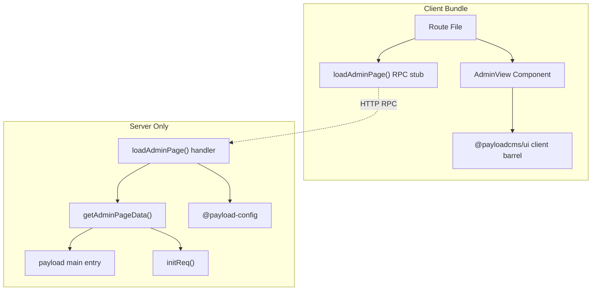

# TanStack Server/Client Boundary Refactor

## Problem

The current `vite.config.ts` has ~200 lines of Node.js module stubs (dns, fs, crypto, stream, pino, mongoose, etc.) because server-only code from `payload` leaks into the client bundle. This happens because:

1. Route files (`admin.$.tsx`, `__root.tsx`) import server-only functions (`getAdminPageData`, `getLayoutData`, `handleServerFunctions`, `config`) at the **module top level**
2. `@payloadcms/tanstack-start/views` barrel-exports both `AdminView` (client) and `getAdminPageData` (server) from the same entry point
3. When the client loads any import from the barrel, it pulls the entire module graph including all server dependencies

## Solution

Follow TanStack Start's recommended `.functions.ts` / `.server.ts` file conventions and split the `@payloadcms/tanstack-start` package exports so client and server code have separate entry points.



## Step 1: Move `test/tanstack-app/` to root `tanstack-app/`

- `cp -r test/tanstack-app/ tanstack-app/`
- Add `tanstack-app` to `pnpm-workspace.yaml` packages list
- Create `tanstack-app/package.json` as its own workspace package (with deps on `@payloadcms/*`, `@tanstack/*`, `vite`, `react`, etc.)
- Update `test/adapters/tanstackStartDevServer.ts`: change `rootDir` from `../tanstack-app` to `../../tanstack-app`
- Update `tanstack-app/tsconfig.json`: change `extends` from `../../tsconfig.base.json` to `../tsconfig.base.json`, update `@payload-config` path
- Update `tanstack-app/vite.config.ts`: update all relative paths (to `packages/`, `test/` configs)

## Step 2: Split `@payloadcms/tanstack-start` package exports

Currently `./views` exports both client and server code from one barrel:

```typescript
// Current: packages/tanstack-start/src/exports/views.ts
export { AdminView } from '../views/AdminView.js' // client
export { getAdminPageData } from '../views/Root/index.js' // server
export { getRouteData } from '../views/Root/getRouteData.js' // server
```

Split into two entry points in `packages/tanstack-start/package.json`:

- **`./views`** — client-safe view components only (`AdminView` + types)
- **`./views/server`** — new entry — server-only data loaders (`getAdminPageData`, `getRouteData`)

Create `packages/tanstack-start/src/exports/views-server.ts`:

```typescript
export { getRouteData } from '../views/Root/getRouteData.js'
export type {
  GetRouteDataResult,
  ViewFromConfig,
} from '../views/Root/getRouteData.js'
export { getAdminPageData } from '../views/Root/index.js'
export type {
  AdminPageData,
  GetAdminPageDataArgs,
  SerializableDashboardData,
  SerializableListData,
  SerializableLoginData,
  SerializableRouteData,
} from '../views/Root/index.js'
```

Trim `packages/tanstack-start/src/exports/views.ts` to client-only:

```typescript
export { AdminView } from '../views/AdminView.js'
export type { AdminViewProps } from '../views/AdminView.js'
// Keep type-only re-exports (they're erased at compile time)
export type { AdminPageData, SerializableRouteData, ... } from '../views/Root/index.js'
```

Similarly for `./layouts`: split `getLayoutData` (server) from `RootLayout` (client) if needed.

## Step 3: Create `.functions.ts` files with dynamic imports

Following TanStack's recommended pattern, create server function wrapper files. Inside the handlers, use **dynamic imports** for all server-only modules. This guarantees they never enter the client bundle regardless of bundler behavior.

**`tanstack-app/src/functions/admin.functions.ts`:**

```typescript
import { redirect } from '@tanstack/react-router'
import { createServerFn } from '@tanstack/react-start'

export const loadDashboard = createServerFn({ method: 'GET' }).handler(
  async () => {
    const { getAdminPageData } = await import(
      '@payloadcms/tanstack-start/views/server'
    )
    const config = (await import('@payload-config')).default
    const { importMap } = await import('../importMap.js')

    const result = await getAdminPageData({
      configPromise: config,
      importMap,
      params: { segments: [] },
      searchParams: {},
    })

    if ('redirect' in result) {
      throw redirect({ to: result.redirect })
    }
    return result.data
  },
)

export const loadAdminPage = createServerFn({ method: 'GET' })
  .inputValidator(
    (data: { _splat: string; search: Record<string, string | string[]> }) =>
      data,
  )
  .handler(async ({ data }) => {
    const { getAdminPageData } = await import(
      '@payloadcms/tanstack-start/views/server'
    )
    const config = (await import('@payload-config')).default
    const { importMap } = await import('../importMap.js')

    const segments = data._splat ? data._splat.split('/').filter(Boolean) : []
    const result = await getAdminPageData({
      configPromise: config,
      importMap,
      params: { segments },
      searchParams: data.search ?? {},
    })

    if ('redirect' in result) {
      throw redirect({ to: result.redirect })
    }
    return result.data
  })
```

**`tanstack-app/src/functions/layout.functions.ts`:**

```typescript
import { createServerFn } from '@tanstack/react-start'

export const getLayoutDataFn = createServerFn({ method: 'GET' }).handler(
  async () => {
    const { getLayoutData } = await import('@payloadcms/tanstack-start/layouts')
    const config = (await import('@payload-config')).default
    const { importMap } = await import('../importMap.js')
    return getLayoutData({ configPromise: config, importMap })
  },
)
```

## Step 4: Rewrite route files to use only client-safe imports

Route files import ONLY from:

- `.functions.ts` files (the `createServerFn` wrappers — become RPC stubs on client)
- `@payloadcms/tanstack-start/views` (client-only view components)
- `@payloadcms/tanstack-start/client` (router adapter, etc.)
- `@payloadcms/ui` (client barrel)
- `@tanstack/react-router` / `@tanstack/react-start`

**`admin.index.tsx`** (simplified):

```tsx
import { AdminView } from '@payloadcms/tanstack-start/views'
import { createFileRoute } from '@tanstack/react-router'
import { loadDashboard } from '../functions/admin.functions'

export const Route = createFileRoute('/admin/')({
  loader: () => loadDashboard(),
  component: () => <AdminView {...Route.useLoaderData()} />,
})
```

**`__root.tsx`** — remove top-level `config`, `handleServerFunctions`, `getLayoutData` imports. Import `getLayoutDataFn` from `.functions.ts` instead.

## Step 5: Simplify `vite.config.ts`

With proper server/client separation, remove the entire `payloadClientBoundary` plugin (~200 lines of Node.js module stubs). Keep only:

- **`tanstackVirtualModuleFallback`** — still needed for the `tanstack-start-injected-head-scripts:v` virtual module
- **`payloadSsrMiddleware`** — still needed to inject Vite dev scripts into SSR HTML
- **Standard config**: `resolve.alias` for `@payload-config`, SCSS importers, `optimizeDeps.exclude`, `ssr.external`

The `optimizeDeps.exclude` list can also be trimmed since `payload` won't be loaded on the client.

## Step 6: Handle `serverFunctionHandler` in `__root.tsx`

The `serverFunctionHandler` passed to `RootProvider` is currently a bare async function, not a `createServerFn`. It needs to become a proper server function so it runs on the server when called from the client:

```typescript
import { createServerFn } from '@tanstack/react-start'

const serverFunctionHandler = createServerFn({ method: 'POST' })
  .inputValidator((data: any) => data)
  .handler(async ({ data }) => {
    const { handleServerFunctions } = await import(
      '@payloadcms/tanstack-start/server'
    )
    const config = (await import('@payload-config')).default
    const { importMap } = await import('../importMap.js')
    return handleServerFunctions({ ...data, config, importMap })
  })
```

## File change summary

- `tanstack-app/` (new at root) — Move from `test/tanstack-app/`
- `tanstack-app/package.json` — Create as workspace package
- `tanstack-app/tsconfig.json` — Update relative paths
- `tanstack-app/vite.config.ts` — Simplify massively (remove ~200 lines of stubs)
- `tanstack-app/src/functions/admin.functions.ts` — New: server fn wrappers
- `tanstack-app/src/functions/layout.functions.ts` — New: layout server fn
- `tanstack-app/src/app/__root.tsx` — Remove server imports, use functions
- `tanstack-app/src/app/admin.$.tsx` — Remove server imports, use functions
- `tanstack-app/src/app/admin.index.tsx` — Remove server imports, use functions
- `pnpm-workspace.yaml` — Add `tanstack-app`
- `packages/tanstack-start/package.json` — Add `./views/server` export
- `packages/tanstack-start/src/exports/views.ts` — Keep client-only exports
- `packages/tanstack-start/src/exports/views-server.ts` — New: server data loaders
- `test/adapters/tanstackStartDevServer.ts` — Update rootDir path
