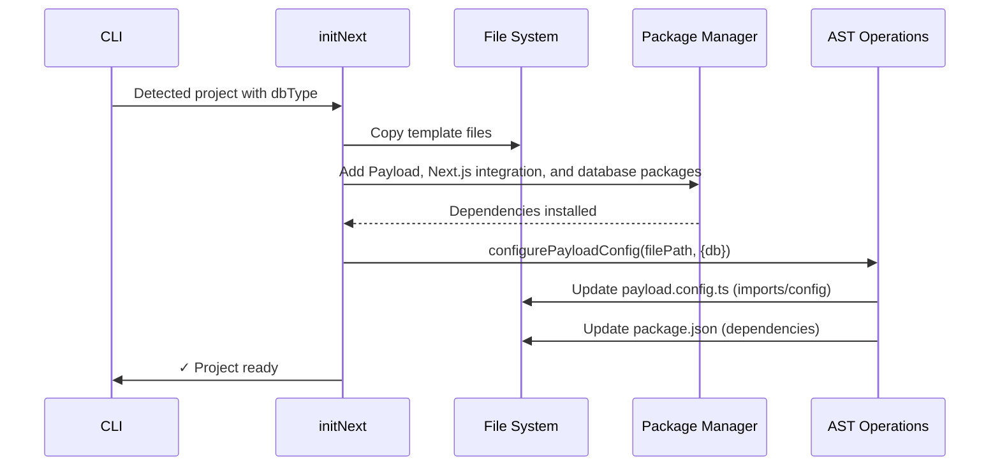
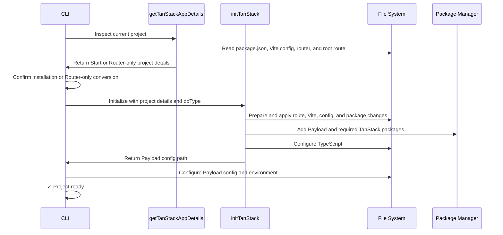
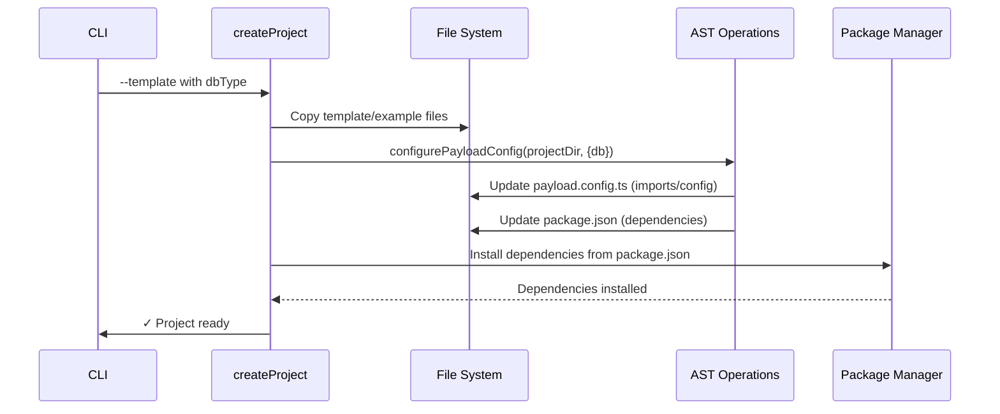

# create-payload-app

Package for creating new Payload projects with custom configurations.

## Architecture

### AST-Based File Modification

create-payload-app uses AST (Abstract Syntax Tree) parsing with ts-morph to modify template files during project creation.

**3-Phase Pipeline:**

1. **Detection** - Parse files and locate expected structures
2. **Transformation** - Pure functions modify AST
3. **Modification** - Validate, write, format with prettier

### File Structure

```txt
src/lib/ast/
├── types.ts                    # Shared types for AST operations
├── utils.ts                    # Low-level AST helpers
├── utils.spec.ts              # Unit tests for utils
├── payload-config.ts          # Payload config transformations
├── payload-config.spec.ts    # Unit tests for payload-config
├── package-json.ts            # package.json modifications
└── package-json.spec.ts      # Unit tests for package-json
```

### Key Functions

**High-level API:**

- `configurePayloadConfig(filePath, options)` - Main entry point for payload config
- `updatePackageJson(filePath, options)` - Update package.json

**Public commands API (`create-payload-app/commands`):**

- `getNextAppDetails(projectDir)` - Detect a compatible existing Next.js project
- `initNext(options)` - Initialize Payload in a detected Next.js project
- `getTanStackAppDetails({ projectDir })` - Detect a compatible existing TanStack Start or conventional Router-only project
- `initTanStack(options)` - Initialize Payload in a detected TanStack project

**Transformations:**

- `addDatabaseAdapter(sourceFile, adapter, envVar)` - Add/replace db adapter
- `addStorageAdapter(sourceFile, adapter)` - Add storage plugin
- `removeSharp(sourceFile)` - Remove sharp dependency

### Templates

All templates follow standard structure:

- `buildConfig()` call with object literal argument
- `db` property for database adapter
- `plugins` array (can be empty)

No comment markers needed - AST finds structure by code patterns.

### Package Management Flows

create-payload-app has three distinct flows for handling package installation:
The CLI uses the selected npm, Yarn, pnpm, or Bun package manager for each flow.

#### Flow 1: Next.js Integration



**Key points:**

- Uses the selected package manager to add specific packages
- Packages installed before AST modifications
- No final dependency install step

#### Flow 2: TanStack Integration

When the CLI runs without a project name, it detects conventional TanStack Start and TanStack Router-only React projects in the current directory. Router-only projects are converted to TanStack Start only after the user confirms the conversion.



**Key points:**

- Detection requires the conventional React TanStack project structure
- Existing TanStack Start projects retain their application routes and root component
- Router-only projects replace the Router Vite plugin with TanStack Start and add the Start package
- Prepared source and package changes are applied before dependency installation

#### Flow 3: Template/Example Creation



**Key points:**

- Updates package.json first
- A single install at the end installs all dependencies
- Package manager resolves dependencies from package.json

**Package Operations:**

- **Install**: Runs the selected package manager's add command for existing Next.js and TanStack projects, or install command for template/example creation
- **Package removal**: AST removes imports and updates package.json (orphaned packages cleaned up on next install)
- No explicit package-manager remove command - package.json modifications only

### Existing Payload Upgrades

When Payload is already installed in a detected Next.js or TanStack project, the CLI offers to upgrade it instead of initializing it again. The upgrade aligns every existing `payload` and `@payloadcms/*` entry in dependencies and devDependencies to the requested version. TanStack upgrades also refresh only Payload-owned `_payload` route files from the current template.

### Testing

**Unit tests:** Test individual transformation functions
**Integration tests:** Test full create-payload-app flows

Run tests: `pnpm --filter create-payload-app test`
